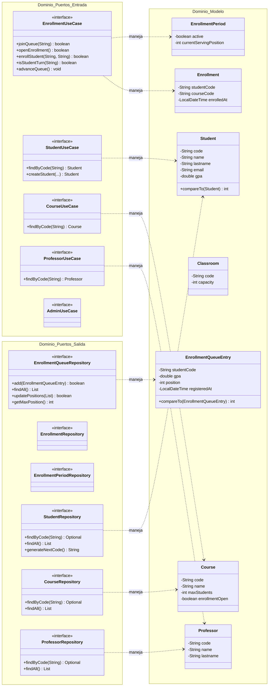
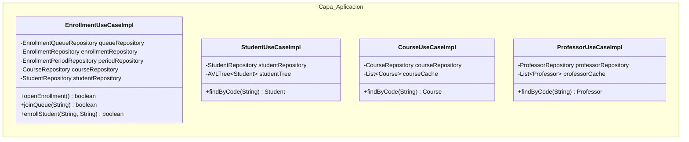
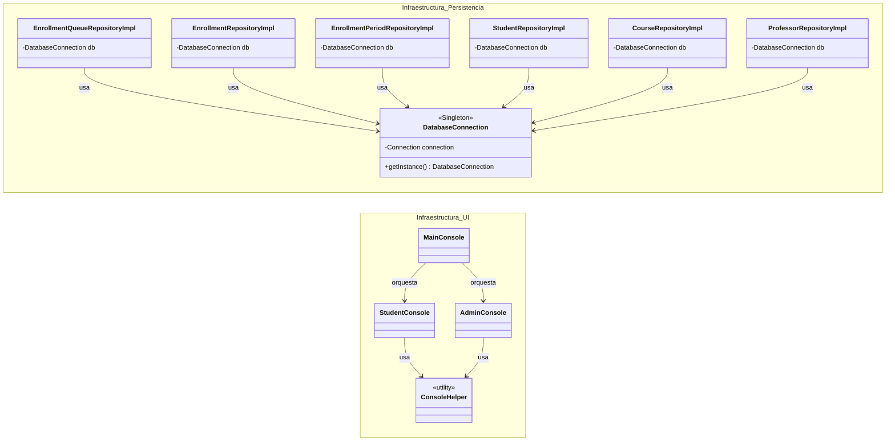
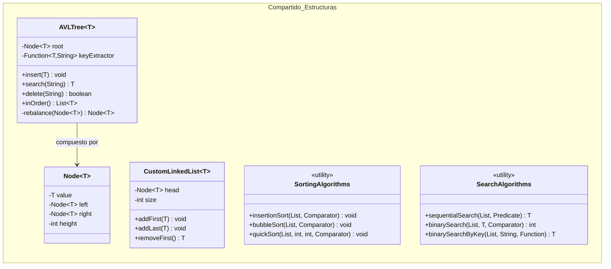
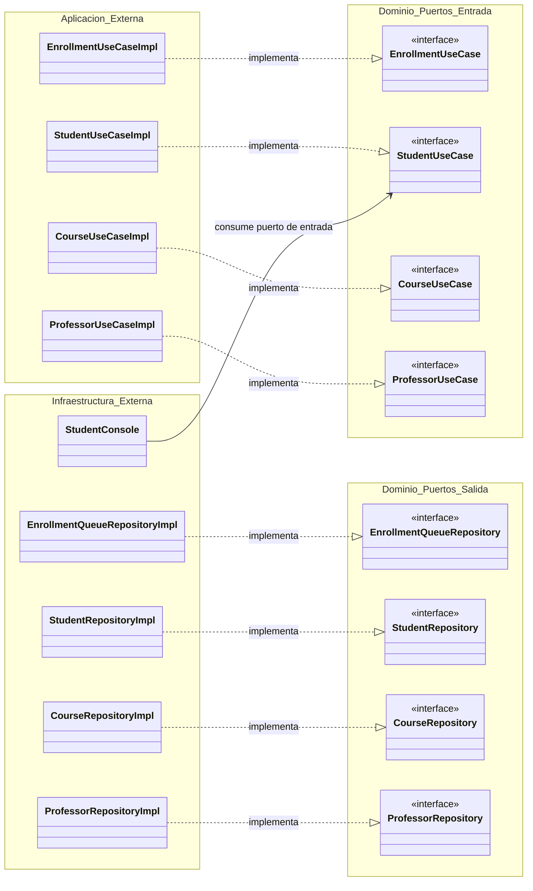
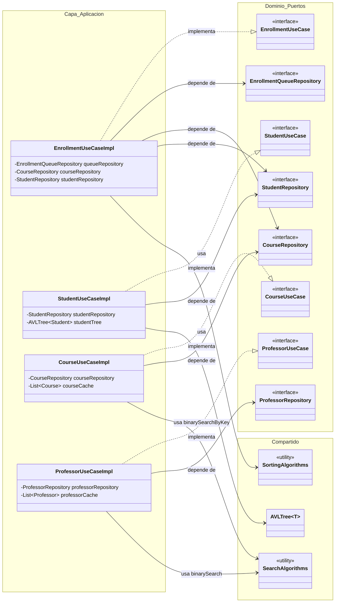
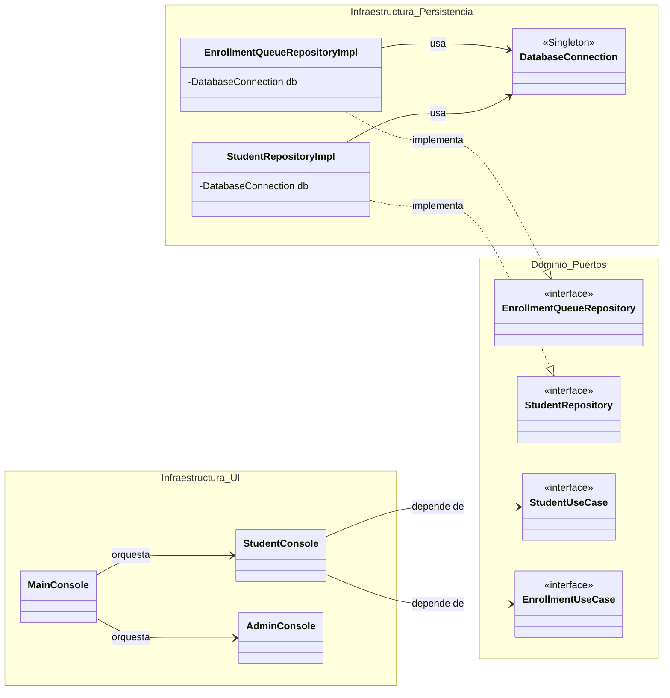
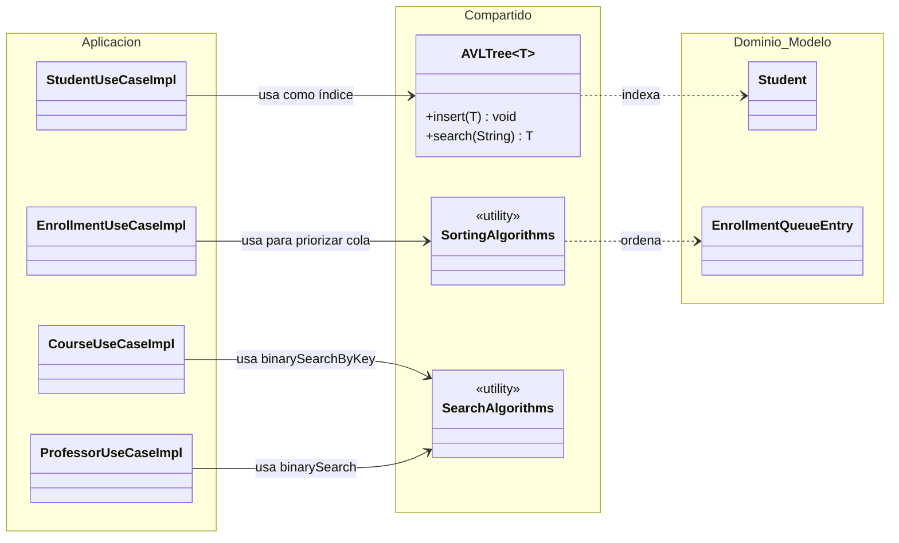
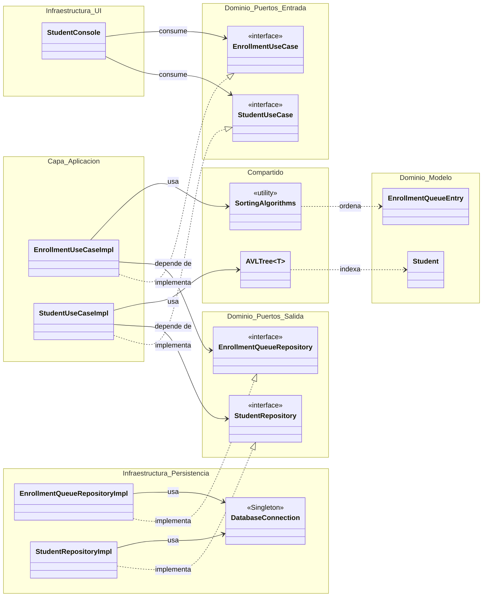

# Diagramas de Clases por Capa — Arquitectura Hexagonal

Este documento descompone el diagrama de clases general del sistema (sección 4.2 del informe técnico) en vistas parciales, una por cada capa de la Arquitectura Hexagonal (*Ports and Adapters*, Cockburn 2005). El objetivo es facilitar la lectura del diseño en dos niveles:

1. **Vista aislada**: cada capa mostrada únicamente con sus relaciones internas.
2. **Vista con relaciones cruzadas**: cada capa mostrada junto con las clases de las capas con las que interactúa directamente.

Al final se incluye una **vista global reducida**, pensada como diagrama de portada del capítulo, con solo las clases más representativas de cada capa.

---

## Parte 1: Diagramas aislados por capa

### 1.1 Capa de Dominio (aislada)

> **Nota:** dentro de la capa de dominio no existen dependencias de implementación (`..|>`) ni de inyección (`-->`), porque esas relaciones cruzan hacia aplicación e infraestructura. Aquí solo aparecen las relaciones de "manejo" entre puertos y entidades, que sí son internas al dominio.

---

### 1.2 Capa de Aplicación (aislada)

> **Nota:** esta capa, vista de forma aislada, es prácticamente una lista de clases sin relaciones entre sí. Su naturaleza es depender exclusivamente de abstracciones del dominio (puertos de salida) y de utilidades compartidas — por eso no existen aristas internas propias de la capa de aplicación.

---

### 1.3 Capa de Infraestructura (aislada)

---

### 1.4 Capa Compartida / Transversal (aislada)

> **Nota:** `SortingAlgorithms` y `SearchAlgorithms` son utilidades sin estado y sin relación estructural con `AVLTree` o `CustomLinkedList`; por eso quedan sueltas en el diagrama aislado.

---

## Parte 2: Diagramas por capa con relaciones hacia otras capas

### 2.1 Dominio ↔ (Aplicación + Infraestructura)

> El dominio es el eje de la inversión de dependencias: recibe implementaciones desde aplicación (puertos de entrada) e infraestructura (puertos de salida), pero nunca las referencia directamente en su propio código — las flechas de implementación siempre "apuntan hacia" el dominio.

---

### 2.2 Aplicación ↔ (Dominio + Compartido)

> Este es el diagrama que mejor evidencia el rol "orquestador" de la aplicación: implementa puertos de entrada (hacia el dominio), inyecta puertos de salida (también del dominio, aunque implementados en infraestructura) y consume las estructuras/algoritmos de la capa compartida.

---

### 2.3 Infraestructura ↔ Dominio

> Aquí se ve la doble cara de la infraestructura: el adaptador de persistencia **implementa** puertos de salida del dominio, mientras que el adaptador de consola **consume** puertos de entrada del dominio — nunca al revés, y nunca conociéndose entre sí (`StudentConsole` no conoce `StudentRepositoryImpl`).

---

### 2.4 Compartido ↔ Aplicación/Dominio

> Lo relevante de este diagrama: `shared` no depende de nadie (ni dominio ni aplicación), pero sí es referenciado por ambos — su rol es puramente utilitario y transversal, coherente con el hecho de que puede reutilizarse en cualquier capa.

---

## Parte 3: Vista global reducida

Diagrama de portada del capítulo: una selección de clases representativas por cada capa, mostrando el flujo completo de dependencias del sistema (UI → puertos de entrada → aplicación → puertos de salida → persistencia), más el punto de apoyo transversal de `shared`.

> **Lectura del diagrama:** siguiendo el flujo de izquierda a derecha se observa el ciclo completo de una petición: la consola consume un puerto de entrada, la implementación de aplicación satisface ese puerto y a la vez depende de un puerto de salida (abstracción), el cual es finalmente implementado por el adaptador de persistencia que usa la conexión Singleton. En paralelo, la capa `shared` se apoya transversalmente sobre la aplicación para indexar (`AVLTree`) y ordenar (`SortingAlgorithms`) entidades del dominio, sin depender de ninguna otra capa. Esta es la síntesis visual del Principio de Inversión de Dependencias aplicado en el proyecto.

---

## Índice de diagramas

| # | Diagrama | Tipo |
|---|----------|------|
| 1.1 | Capa de Dominio | Aislado |
| 1.2 | Capa de Aplicación | Aislado |
| 1.3 | Capa de Infraestructura | Aislado |
| 1.4 | Capa Compartida | Aislado |
| 2.1 | Dominio ↔ Aplicación/Infraestructura | Con relaciones cruzadas |
| 2.2 | Aplicación ↔ Dominio/Compartido | Con relaciones cruzadas |
| 2.3 | Infraestructura ↔ Dominio | Con relaciones cruzadas |
| 2.4 | Compartido ↔ Aplicación/Dominio | Con relaciones cruzadas |
| 3 | Vista global reducida | Síntesis general |
