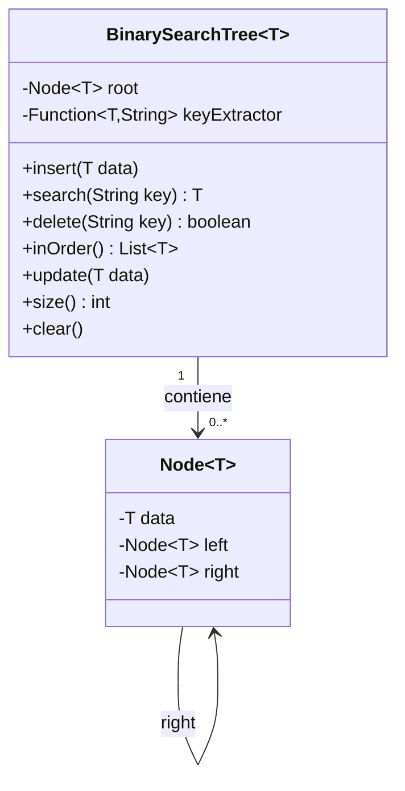
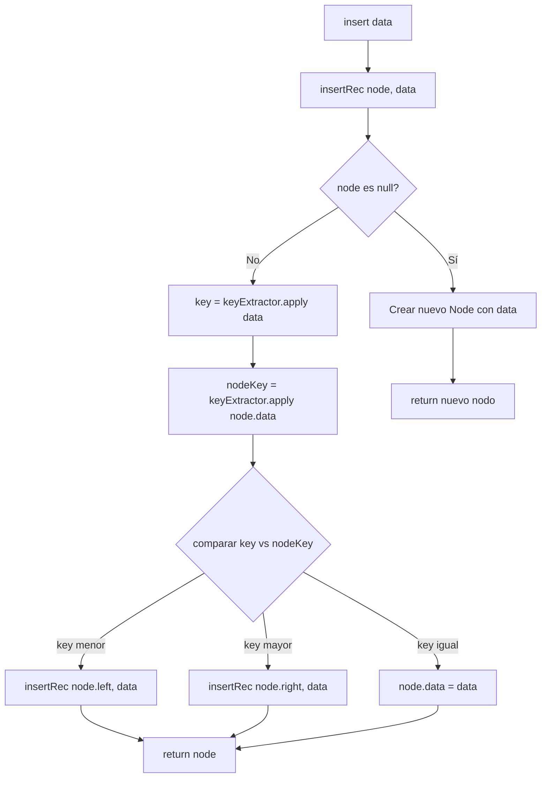
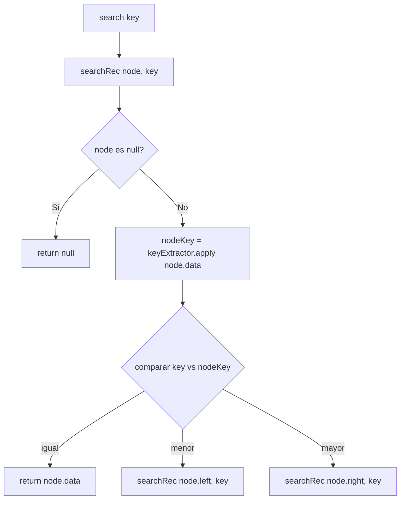
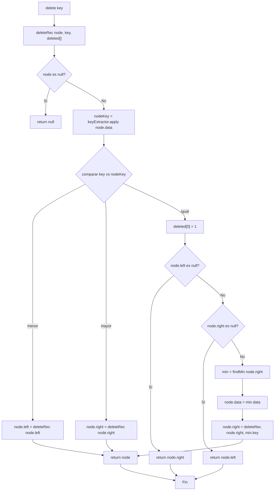
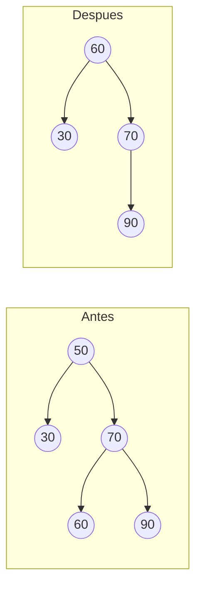
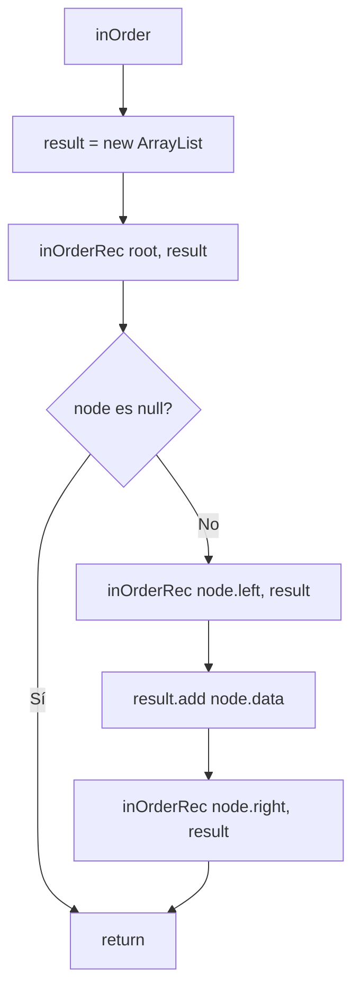
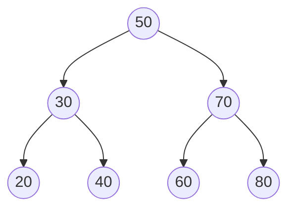
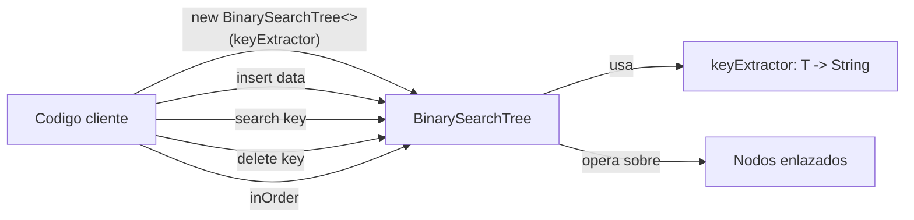

# Documentación Técnica: Árbol Binario de Búsqueda Genérico (`BinarySearchTree<T>`)

## 1. Descripción General

La clase `BinarySearchTree<T>` implementa un **Árbol Binario de Búsqueda (ABB)** genérico en Java, ubicado en el paquete `shared.datastructure`. Su propósito es almacenar objetos de cualquier tipo `T` (por ejemplo, alumnos) y permitir operaciones de inserción, búsqueda, actualización y eliminación indexadas por una **clave de tipo `String`**.

A diferencia de un ABB tradicional que compara directamente los datos almacenados, esta implementación utiliza el patrón de diseño **Strategy**, mediante una función `keyExtractor` que define **cómo obtener la clave de comparación** a partir de un objeto `T`. Esto hace que la estructura sea completamente reutilizable para cualquier clase de dominio, sin necesidad de modificar el árbol.

---

## 2. Principios de Algoritmos y Estructuras de Datos Utilizados

| Principio | Dónde se aplica | Explicación |
|---|---|---|
| **Propiedad de ABB** | `insertRec`, `searchRec`, `deleteRec` | Para cualquier nodo, todos los valores del subárbol izquierdo son menores y los del subárbol derecho son mayores, según la clave. |
| **Recursión (Divide y Vencerás)** | Todos los métodos `*Rec` | Cada operación se aplica recursivamente sobre subárboles cada vez más pequeños hasta alcanzar un caso base (`node == null`). |
| **Genéricos (Generics)** | `class BinarySearchTree<T>` | Permite que el árbol funcione con cualquier tipo de objeto, manteniendo seguridad de tipos en compilación. |
| **Programación funcional / Strategy Pattern** | `Function<T, String> keyExtractor` | Desacopla la lógica de comparación del árbol. El "cómo obtener la clave" se inyecta desde fuera (por ejemplo, `alumno -> alumno.getCodigo()`). |
| **Recorrido In-Order** | `inOrder()` | Técnica clásica de recorrido de árboles que, aplicada a un ABB, produce los elementos **ordenados ascendentemente** por clave. |
| **Sucesor in-order (mínimo del subárbol derecho)** | `findMin()` en `deleteRec` | Algoritmo estándar para eliminar un nodo con dos hijos, preservando la propiedad del ABB. |
| **Complejidad logarítmica esperada** | Todas las operaciones | En un árbol balanceado, `insert`, `search` y `delete` tienen complejidad **O(log n)**; en el peor caso (árbol degenerado), **O(n)**. |

> **Nota importante:** Esta clase es un ABB **simple, no balanceado**. A diferencia de un AVL, no reequilibra automáticamente el árbol tras cada inserción/eliminación. Si los datos se insertan en orden (ya ordenados), el árbol se degenera en una lista enlazada, perdiendo la ventaja de O(log n).

---

## 3. Estructura Interna: Clase `Node<T>`

```java
private static class Node<T> {
    T data;
    Node<T> left;
    Node<T> right;
}
```

- Es una **clase interna estática** (no depende de una instancia externa de `BinarySearchTree`), lo cual ahorra memoria porque no guarda una referencia implícita al objeto contenedor.
- Cada nodo almacena:
  - `data`: el objeto real (ej. un alumno).
  - `left` / `right`: referencias a los subárboles izquierdo y derecho.



---

## 4. Flujo del Método `insert()`

El método público `insert(T data)` delega en el recursivo `insertRec(node, data)`.

**Lógica:**
1. Si el nodo actual es `null`, se crea un nuevo nodo ahí (caso base).
2. Se extrae la clave del nuevo dato y la del nodo actual usando `keyExtractor`.
3. Se comparan las claves con `compareTo`:
   - Si `key < nodeKey` → se inserta en el subárbol **izquierdo**.
   - Si `key > nodeKey` → se inserta en el subárbol **derecho**.
   - Si son **iguales** → se **actualiza** el dato del nodo existente (comportamiento tipo "upsert").



---

## 5. Flujo del Método `search()`

Búsqueda binaria clásica sobre el árbol, guiada por comparación de claves.

**Lógica:**
1. Si `node == null`, no se encontró el elemento → retorna `null`.
2. Se compara la clave buscada con la del nodo actual.
3. Si coincide, se retorna el dato.
4. Si es menor, se busca recursivamente en el subárbol izquierdo; si es mayor, en el derecho.



---

## 6. Flujo del Método `delete()`

Es el método más complejo, ya que debe manejar **tres casos** al eliminar un nodo, preservando siempre la propiedad del ABB.

**Casos de eliminación:**

1. **Nodo hoja o con un solo hijo:** se reemplaza el nodo por su único hijo (o por `null` si no tiene hijos).
2. **Nodo con dos hijos:** se busca el **sucesor in-order** (el valor mínimo del subárbol derecho, vía `findMin`), se copia su dato al nodo actual, y luego se elimina ese sucesor de su posición original (que, por definición, tiene a lo sumo un hijo derecho).

El arreglo `int[] deleted` se usa como **"flag" mutable** para poder informar, tras la recursión, si realmente se eliminó algo (Java no permite pasar `boolean` por referencia, por eso se usa un array de tamaño 1 como truco).



### Caso especial: nodo con dos hijos (sucesor in-order)


*Al eliminar el nodo `50` (que tiene dos hijos), se busca el mínimo del subárbol derecho (`60`), se copia su valor a la raíz, y luego se elimina el `60` original de su posición.*

---

## 7. Flujo del Método `inOrder()`

Recorre el árbol en el orden **izquierda → nodo → derecha**, lo cual, gracias a la propiedad del ABB, produce la lista de elementos **ordenada ascendentemente** según la clave.



**Ejemplo de recorrido in-order sobre un árbol:**



Recorrido in-order resultante: `20 → 30 → 40 → 50 → 60 → 70 → 80` (orden ascendente).

---

## 8. Otros Métodos

| Método | Descripción |
|---|---|
| `update(T data)` | Es un alias de `insert()`. Como `insertRec` ya reemplaza el dato cuando encuentra una clave igual, no se necesita lógica adicional. |
| `size()` | Cuenta recursivamente el número de nodos: `1 + size(left) + size(right)`. |
| `clear()` | Elimina toda la referencia a la raíz (`root = null`), permitiendo que el recolector de basura de Java libere los nodos. |

---

## 9. Diagrama de Flujo General (Vista de Alto Nivel)



---

## 10. Análisis de Complejidad

| Operación | Mejor / Promedio caso | Peor caso (árbol degenerado) |
|---|---|---|
| `insert` | O(log n) | O(n) |
| `search` | O(log n) | O(n) |
| `delete` | O(log n) | O(n) |
| `inOrder` | O(n) | O(n) |
| `size` | O(n) | O(n) |

El peor caso ocurre cuando los datos se insertan en orden estrictamente creciente o decreciente de clave, generando un árbol equivalente a una lista enlazada. Para garantizar O(log n) en **todos** los casos, se necesitaría una variante auto-balanceada como **AVL** o **Árbol Rojo-Negro**.

---

## 11. Ejemplo de Uso

```java
// Suponiendo una clase Alumno con getCodigo()
BinarySearchTree<Alumno> arbol = new BinarySearchTree<>(Alumno::getCodigo);

arbol.insert(new Alumno("A001", "Juan Perez"));
arbol.insert(new Alumno("A005", "Maria Lopez"));
arbol.insert(new Alumno("A003", "Carlos Ruiz"));

Alumno encontrado = arbol.search("A003"); // Carlos Ruiz

List<Alumno> ordenados = arbol.inOrder(); // A001, A003, A005

arbol.delete("A005");
```

---

## 12. Conclusiones

- La estructura implementa correctamente los principios fundamentales de un **Árbol Binario de Búsqueda**: comparación por clave, recursión, y mantenimiento del invariante izquierda-menor / derecha-mayor.
- El uso de **genéricos** y un **`Function<T, String>` como extractor de clave** convierte esta implementación en una estructura de datos **reutilizable y desacoplada del dominio**, aplicable a cualquier entidad (alumnos, productos, tickets, etc.).
- Es una estructura **no balanceada**, por lo que su eficiencia depende del orden de inserción de los datos. Para escenarios donde se requiera rendimiento garantizado (ej. sistemas críticos), sería recomendable evolucionar hacia un AVL.
- El manejo de la eliminación de nodos con dos hijos mediante el **sucesor in-order** es la técnica estándar de la literatura de estructuras de datos (Cormen et al., *Introduction to Algorithms*).
