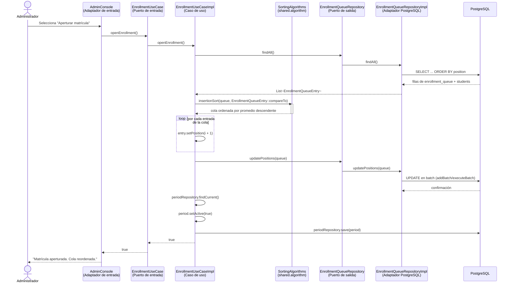
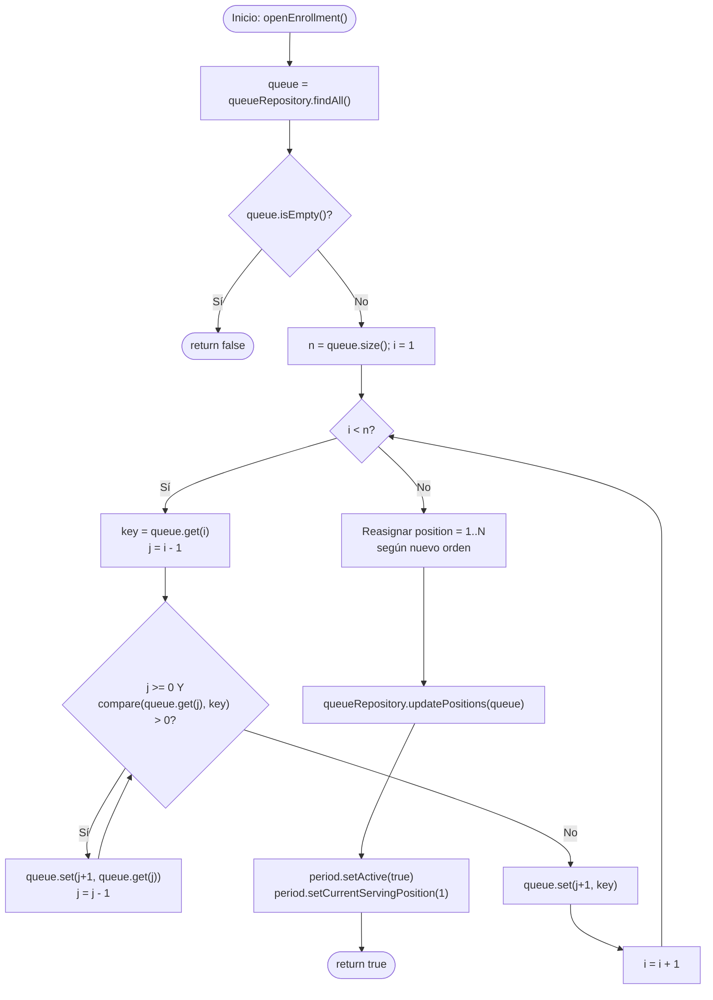
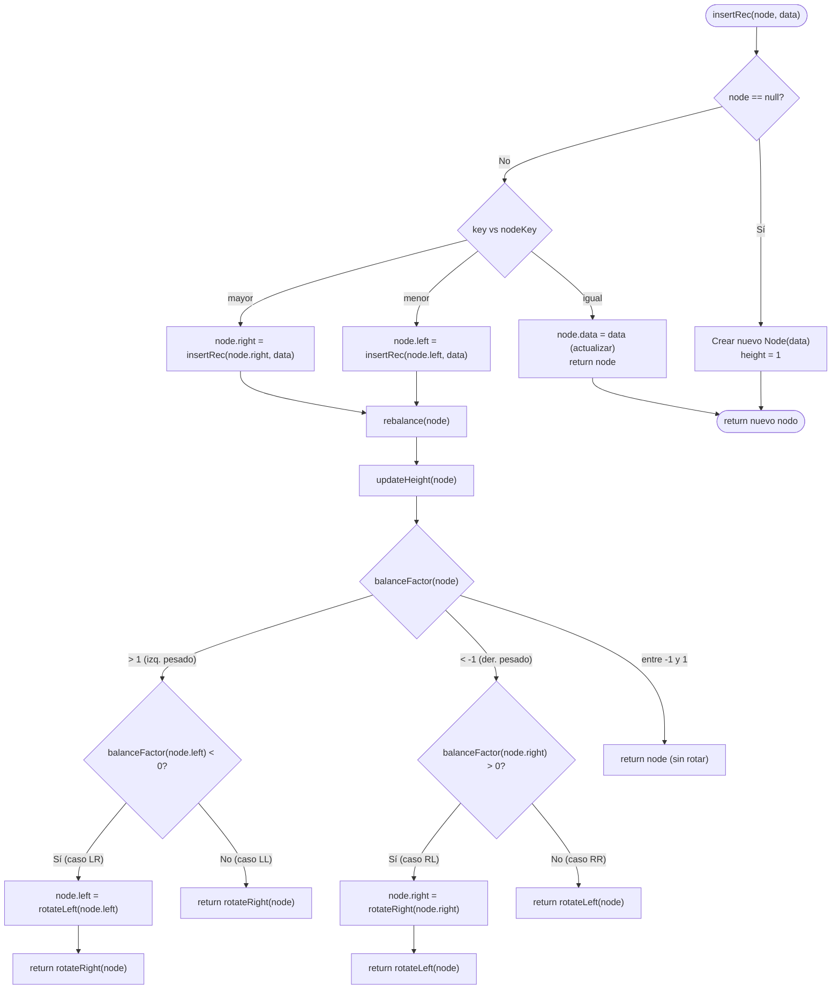
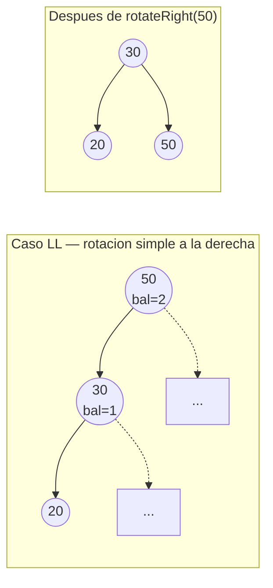

# Informe Técnico

# Sistema de Matrículas — Proyecto Final

## Aplicación de Arquitectura Hexagonal, Estructuras de Datos y Algoritmos Nativos en Java

---

**Autor:** Jesus Llica
**Curso:** Algoritmos y Estructuras de Datos
**Proyecto:** Proyecto final — Sistema de matrículas
**Fecha:** 17 de julio de 2026

---

## 1. Introducción

### 1.1. Contexto

Las instituciones de educación superior enfrentan, en cada periodo académico, el reto operativo de asignar cupos de cursos a un número de estudiantes que habitualmente supera la oferta disponible. Este problema, análogo al de un sistema de turnos de atención al cliente, exige una regla de prioridad transparente, una estructura de datos que soporte consultas frecuentes por identificador único y un mecanismo de ordenamiento que determine, de manera determinística, el orden en que los estudiantes acceden al proceso de matrícula.

El presente informe documenta el diseño y la implementación de un **Sistema de Matrículas** desarrollado en Java bajo los principios de la **Arquitectura Hexagonal** (también denominada *Ports and Adapters*, propuesta originalmente por Cockburn, 2005). El proyecto se distingue por implementar de forma nativa —sin recurrir a colecciones especializadas de terceros ni a `java.util.Collections` avanzadas— las estructuras de datos y los algoritmos que sostienen su lógica de negocio central: un **Árbol AVL** genérico y autobalanceado, una **lista enlazada simple** propia y un conjunto de **algoritmos de búsqueda y ordenamiento** implementados desde cero. La única dependencia externa del sistema es el controlador JDBC de PostgreSQL, utilizado exclusivamente para la persistencia de datos.

### 1.2. Problema que se busca resolver

El problema de negocio que motiva el proyecto es la **gestión del proceso de matrícula universitaria mediante una cola de prioridad basada en el promedio ponderado del estudiante**. Antes de la apertura oficial de matrícula, los estudiantes pueden inscribirse en una cola de espera. Al aperturarse el periodo, el sistema debe:

1. Reordenar a todos los estudiantes en cola según su promedio ponderado (de mayor a menor), de modo que los estudiantes con mejor rendimiento académico obtengan prioridad de elección de cursos.
2. Garantizar que cada estudiante solo pueda matricularse cuando le corresponda su turno.
3. Validar restricciones de negocio (límite de cursos por alumno, duplicidad de matrícula, disponibilidad de vacantes por curso).
4. Permitir a un administrador gestionar cursos, profesores, aulas y el estado general o particular de la matrícula.

Desde la perspectiva académica, el problema adicional que se busca resolver es demostrar la comprensión profunda de las estructuras de datos y algoritmos fundamentales, evitando el uso de abstracciones de alto nivel del lenguaje (como `TreeMap`, `PriorityQueue` o `Collections.sort`) que ocultarían la lógica interna que se pretende evidenciar.

### 1.3. Alcance del trabajo

El alcance del proyecto comprende:

- El diseño de una arquitectura hexagonal estricta, con separación explícita entre dominio, puertos y adaptadores de infraestructura.
- La implementación nativa de un Árbol AVL genérico y autobalanceado (`AVLTree<T>`) y de una lista enlazada simple genérica (`CustomLinkedList<T>`).
- La implementación nativa de algoritmos de ordenamiento (*Insertion Sort*, *Bubble Sort*, *Quick Sort*) y de búsqueda (secuencial, binaria y binaria por transformación de clave).
- La integración de dichas estructuras y algoritmos en los casos de uso reales del sistema: la cola de matrícula ordenada por Insertion Sort, el índice de estudiantes respaldado por el Árbol AVL, y la búsqueda de cursos y profesores resuelta mediante `SearchAlgorithms.binarySearchByKey`/`binarySearch` sobre cachés en memoria.
- La persistencia de la información mediante PostgreSQL y JDBC, como único componente externo del sistema.
- Una interfaz de usuario de consola (adaptador de entrada) para los roles de estudiante y administrador.

Quedan fuera del alcance: la implementación de estructuras auto-balanceadas (AVL, Árbol Rojo-Negro), algoritmos de grafos, pruebas automatizadas con frameworks de *testing* (JUnit) y una interfaz gráfica o web.

---

## 2. Objetivos

### 2.1. Objetivo general

Diseñar e implementar un sistema de matrícula universitaria en Java, estructurado bajo Arquitectura Hexagonal, que resuelva el problema de asignación de cupos mediante estructuras de datos y algoritmos de búsqueda y ordenamiento implementados de manera nativa, evidenciando el dominio de los fundamentos de la ciencia de la computación por encima del uso de bibliotecas de terceros.

### 2.2. Objetivos específicos

1. Aplicar los principios de la Arquitectura Hexagonal (separación de Dominio, Puertos de entrada/salida e Infraestructura) para lograr un sistema desacoplado de la tecnología de persistencia.
2. Implementar desde cero un Árbol AVL genérico, autobalanceado y parametrizable mediante una función extractora de clave (patrón *Strategy*), y utilizarlo como índice en memoria para la búsqueda eficiente de estudiantes, garantizando complejidad logarítmica incluso ante patrones de inserción adversos.
3. Implementar desde cero una lista enlazada simple genérica, con sus operaciones fundamentales de inserción, eliminación e iteración.
4. Implementar y comparar algoritmos de ordenamiento (*Insertion Sort*, *Bubble Sort*, *Quick Sort*) y de búsqueda (secuencial y binaria), integrando el algoritmo de ordenamiento más adecuado al flujo real de apertura de matrícula.
5. Modelar la regla de negocio de priorización de matrícula (ordenamiento descendente por promedio ponderado) como un caso de uso ejecutable y verificable.
6. Persistir la información del dominio en una base de datos relacional PostgreSQL mediante JDBC puro, sin frameworks de mapeo objeto-relacional (ORM).
7. Analizar formalmente la complejidad temporal y espacial (notación Big O) de las estructuras y algoritmos implementados, contrastándolos académicamente con las colecciones estándar de Java.

---

## 3. Descripción del problema o negocio simulado

### 3.1. Contexto

El sistema simula el proceso administrativo de matrícula de una universidad. Existen tres actores principales: el **estudiante**, que se inscribe en una cola de espera y posteriormente se matricula en cursos; el **administrador**, que gestiona el catálogo académico (cursos, profesores, aulas) y controla la apertura y cierre de los periodos de matrícula; y el **sistema**, que aplica de manera automática la regla de priorización académica al momento de aperturar la matrícula.

El negocio se apoya conceptualmente en el modelo de un **turnero de atención al cliente**: cada estudiante que ingresa a la cola recibe un número de turno correlativo (posición). Sin embargo, a diferencia de un turnero tradicional de tipo FIFO (*First In, First Out*), este sistema **reordena la cola completa en el momento de la apertura**, de modo que el turno final no depende del orden de llegada sino del mérito académico (promedio ponderado). Este comportamiento corresponde funcionalmente a una **cola de prioridad materializada como lista ordenada persistida**.

### 3.2. Requerimientos funcionales

| # | Requerimiento | Evidencia en código |
|---|---|---|
| RF-01 | El sistema debe permitir a un estudiante unirse a la cola de matrícula antes de la apertura del periodo. | `EnrollmentUseCaseImpl.joinQueue` |
| RF-02 | El sistema debe permitir a un estudiante retirarse de la cola. | `EnrollmentUseCaseImpl.leaveQueue` |
| RF-03 | El sistema debe reordenar la cola de matrícula por promedio ponderado descendente al momento de la apertura, y en caso de empate, alfabéticamente por apellido y luego por nombre. | `EnrollmentUseCaseImpl.openEnrollment`, `EnrollmentQueueEntry.compareTo` |
| RF-04 | El sistema debe permitir a un estudiante matricularse en un curso únicamente cuando la matrícula esté abierta y sea su turno. | `EnrollmentUseCaseImpl.enrollStudent`, `isStudentTurn` |
| RF-05 | El sistema debe limitar la matrícula a un máximo de cinco cursos por estudiante. | `EnrollmentUseCaseImpl.MAX_COURSES_PER_STUDENT` |
| RF-06 | El sistema debe impedir la matrícula duplicada de un estudiante en el mismo curso. | `EnrollmentRepository.existsByStudentAndCourse` |
| RF-07 | El sistema debe impedir la matrícula en un curso sin vacantes disponibles. | `EnrollmentUseCaseImpl.enrollStudent` (validación de `maxStudents`) |
| RF-08 | El sistema debe permitir al administrador crear, listar y actualizar estudiantes, profesores, cursos y aulas. | `StudentUseCaseImpl`, `ProfessorUseCaseImpl`, `CourseUseCaseImpl` |
| RF-09 | El sistema debe permitir al administrador aperturar o cerrar la matrícula de forma global o por curso específico. | `AdminUseCaseImpl.openAllEnrollments`, `openCourseEnrollment` |
| RF-10 | El sistema debe permitir al administrador visualizar un resumen agregado de matrícula (matriculados, vacantes por curso, periodo actual). | `AdminUseCaseImpl.getEnrollmentSummary` |
| RF-11 | El sistema debe generar códigos únicos correlativos para estudiantes, profesores y aulas de forma automática. | `StudentRepositoryImpl.generateNextCode`, tabla `sequence_counters` |
| RF-12 | El sistema debe permitir la búsqueda eficiente de un estudiante por su código institucional. | `StudentUseCaseImpl.findByCode` (vía `AVLTree`) |
| RF-13 | El sistema debe permitir al administrador buscar un curso o un profesor por su código, con complejidad logarítmica. | `CourseUseCaseImpl.findByCode` (vía `SearchAlgorithms.binarySearchByKey`), `ProfessorUseCaseImpl.findByCode` (vía `SearchAlgorithms.binarySearch`) |

### 3.4. Restricciones

- **Tecnológicas:** el sistema debe implementarse en Java puro, sin frameworks de inyección de dependencias (Spring) ni ORM (Hibernate/JPA); la única dependencia externa permitida es el controlador JDBC de PostgreSQL.
- **Algorítmicas:** las estructuras de datos (árbol binario, lista enlazada) y los algoritmos de búsqueda y ordenamiento deben implementarse de forma nativa, sin recurrir a `java.util.TreeMap`, `java.util.LinkedList`, `java.util.Collections.sort`, `java.util.Arrays.binarySearch` ni estructuras equivalentes de la biblioteca estándar para la lógica de negocio central.
- **De negocio:** un estudiante no puede matricularse en más de cinco cursos (`MAX_COURSES_PER_STUDENT = 5`); el promedio ponderado debe estar en el rango [0, 20], validado en la capa de interfaz (`ConsoleHelper.readDouble`); el orden de atención de la cola es estrictamente descendente por promedio, sin excepciones manuales.
- **De persistencia:** toda la información debe sobrevivir al cierre de la aplicación, lo que obliga a sincronizar las estructuras en memoria (el ABB de estudiantes) con el estado persistido en PostgreSQL.
- **De interfaz:** la interacción con el sistema se realiza exclusivamente a través de una interfaz de consola (*Character User Interface*), sin componentes gráficos ni web.

### 3.5. Casos de uso principales

1. **Unirse a la cola de matrícula** (estudiante): el estudiante se autentica por correo institucional y solicita su ingreso a la cola; el sistema le asigna la siguiente posición disponible.
2. **Aperturar matrícula** (administrador): el administrador dispara la apertura del periodo; el sistema ordena la cola completa por promedio ponderado y activa el turno inicial.
3. **Matricularse en cursos** (estudiante): cuando la matrícula está abierta y es el turno del estudiante, este selecciona uno o varios cursos disponibles, respetando el límite de cinco cursos y la disponibilidad de vacantes; al finalizar, cede el turno al siguiente estudiante en la cola.
4. **Gestionar catálogo académico** (administrador): el administrador registra profesores, cursos y aulas, asociando cada aula a un curso y a un profesor.
5. **Consultar resumen de matrícula** (administrador): el administrador visualiza, por curso, el número de matriculados y las vacantes restantes, agregados mediante un `LinkedHashMap`.
6. **Buscar estudiante, curso o profesor por código** (sistema/administrador): el sistema resuelve la búsqueda de estudiantes contra el Árbol AVL cargado en memoria al iniciar el caso de uso de estudiantes, y la búsqueda de cursos y profesores mediante los algoritmos `binarySearchByKey`/`binarySearch` sobre sus respectivas cachés ordenadas por código.

---

## 4. Diseño de la solución

### 4.1. Arquitectura utilizada

El sistema está construido bajo el patrón de **Arquitectura Hexagonal** (*Ports and Adapters*), formulado por Cockburn (2005) con el propósito de aislar la lógica de negocio de los detalles de infraestructura (interfaz de usuario, persistencia, servicios externos), de modo que estos últimos puedan sustituirse sin afectar el núcleo del sistema. El proyecto organiza el código fuente en tres capas concéntricas, reflejadas literalmente en el árbol de paquetes:

**a) Capa de Dominio (`domain`)**

Es el núcleo del sistema y no depende de ninguna otra capa. Se subdivide en:

- `domain.model`: entidades puras del negocio (`Student`, `Professor`, `Course`, `Classroom`, `Enrollment`, `EnrollmentPeriod`, `EnrollmentQueueEntry`), sin anotaciones de persistencia ni referencias a JDBC. `Student` implementa `Comparable<Student>` por código y `EnrollmentQueueEntry` implementa `Comparable<EnrollmentQueueEntry>` según la regla de prioridad de negocio (promedio descendente, luego apellido, luego nombre).
- `domain.port.input`: interfaces que declaran los **casos de uso** que el sistema ofrece hacia el exterior (`EnrollmentUseCase`, `StudentUseCase`, `CourseUseCase`, `ProfessorUseCase`, `AdminUseCase`). Estos puertos son el contrato que consume la capa de interfaz de usuario.
- `domain.port.output`: interfaces que declaran lo que el dominio **necesita** de la infraestructura (`StudentRepository`, `CourseRepository`, `EnrollmentQueueRepository`, etc.), sin especificar cómo se implementa la persistencia.

**b) Capa de Aplicación (`application.usecase`)**

Contiene las implementaciones concretas de los puertos de entrada (por ejemplo, `EnrollmentUseCaseImpl`, `StudentUseCaseImpl`). Estas clases orquestan la lógica de negocio, consumen exclusivamente los **puertos de salida** (interfaces) y no conocen ningún detalle de PostgreSQL o JDBC. Reciben sus dependencias por **inyección de constructor**, como se observa en `EnrollmentUseCaseImpl(EnrollmentQueueRepository, EnrollmentRepository, EnrollmentPeriodRepository, CourseRepository, StudentRepository)`.

**c) Capa de Infraestructura (`infrastructure`)**

Contiene los **adaptadores** que conectan el sistema con el mundo exterior:

- `infrastructure.persistence.postgresql`: adaptadores de salida que implementan los puertos `*Repository` mediante JDBC puro (`PreparedStatement`, `ResultSet`, *text blocks* para consultas con `JOIN`). `DatabaseConnection` aplica el patrón Singleton para gestionar una única conexión activa.
- `infrastructure.ui.console`: adaptador de entrada que implementa la interacción con el usuario mediante consola (`MainConsole`, `StudentConsole`, `AdminConsole`, `ConsoleHelper`). Esta capa depende únicamente de los **puertos de entrada** (`domain.port.input`), nunca de las implementaciones concretas de los casos de uso ni de los repositorios.

Adicionalmente, existe un paquete transversal `shared` (`shared.algorithm`, `shared.datastructure`) que contiene las estructuras de datos y algoritmos nativos, sin dependencias del dominio ni de la infraestructura, de forma que pueden reutilizarse en cualquier capa. Tras la revisión documentada en este informe, dicho paquete incorpora un **Árbol AVL** (`AVLTree<T>`) que sustituye al Árbol Binario de Búsqueda simple como índice de estudiantes en `StudentUseCaseImpl`, y los casos de uso de curso (`CourseUseCaseImpl`) y profesor (`ProfessorUseCaseImpl`) quedaron conectados de forma real a `SearchAlgorithms.binarySearchByKey` y `SearchAlgorithms.binarySearch`, respectivamente, para resolver la búsqueda por código sobre una caché en memoria ordenada.

**Justificación de la inversión de dependencias**

El **Principio de Inversión de Dependencias** (Martin, 2003) establece que los módulos de alto nivel (la lógica de negocio) no deben depender de módulos de bajo nivel (los detalles técnicos), sino que ambos deben depender de abstracciones. En este proyecto, dicho principio se materializa de la siguiente manera:

- `EnrollmentUseCaseImpl` (módulo de alto nivel, capa de aplicación) depende de la interfaz `EnrollmentQueueRepository` (abstracción, definida en el dominio), **no** de `EnrollmentQueueRepositoryImpl` (módulo de bajo nivel, capa de infraestructura).
- Es `EnrollmentQueueRepositoryImpl`, en la capa de infraestructura, quien depende de la abstracción `EnrollmentQueueRepository` implementándola.
- La composición de estas dependencias ocurre en un único punto del sistema: la clase `Main`, que actúa como **composition root** (Seemann, 2011), instanciando primero los adaptadores de infraestructura y luego inyectándolos manualmente en los casos de uso.

Esta inversión permite, a nivel académico y práctico, que la lógica de negocio (la regla de priorización de matrícula, las validaciones de cupos) sea completamente ajena a PostgreSQL: si en el futuro se decidiera migrar la persistencia a otro motor de base de datos o a archivos planos, bastaría con escribir una nueva implementación de los puertos de salida, sin modificar una sola línea de `EnrollmentUseCaseImpl` ni de las entidades del dominio. De igual manera, la interfaz de consola podría reemplazarse por una interfaz web sin alterar el núcleo, dado que ambas dependerían del mismo contrato (`domain.port.input`).

### 4.2. Diagrama de clases o UML

```mermaid
classDiagram
    direction LR

    namespace Dominio_Modelo {
        class Student {
            -String code
            -String name
            -String lastname
            -String email
            -double gpa
            +compareTo(Student) int
        }
        class EnrollmentQueueEntry {
            -String studentCode
            -double gpa
            -int position
            -LocalDateTime registeredAt
            +compareTo(EnrollmentQueueEntry) int
        }
        class Course {
            -String code
            -String name
            -int maxStudents
            -boolean enrollmentOpen
        }
        class Enrollment {
            -String studentCode
            -String courseCode
            -LocalDateTime enrolledAt
        }
        class EnrollmentPeriod {
            -boolean active
            -int currentServingPosition
        }
    }

    namespace Puertos_Entrada {
        class EnrollmentUseCase {
            <<interface>>
            +joinQueue(String) boolean
            +openEnrollment() boolean
            +enrollStudent(String, String) boolean
            +isStudentTurn(String) boolean
            +advanceQueue() void
        }
        class StudentUseCase {
            <<interface>>
            +findByCode(String) Student
            +createStudent(...) Student
        }
        class CourseUseCase {
            <<interface>>
            +findByCode(String) Course
        }
        class ProfessorUseCase {
            <<interface>>
            +findByCode(String) Professor
        }
    }

    namespace Puertos_Salida {
        class EnrollmentQueueRepository {
            <<interface>>
            +add(EnrollmentQueueEntry) boolean
            +findAll() List
            +updatePositions(List) boolean
            +getMaxPosition() int
        }
        class StudentRepository {
            <<interface>>
            +findByCode(String) Optional
            +findAll() List
            +generateNextCode() String
        }
        class CourseRepository {
            <<interface>>
            +findByCode(String) Optional
            +findAll() List
        }
        class ProfessorRepository {
            <<interface>>
            +findByCode(String) Optional
            +findAll() List
        }
    }

    namespace Capa_Aplicacion {
        class EnrollmentUseCaseImpl {
            -EnrollmentQueueRepository queueRepository
            -EnrollmentRepository enrollmentRepository
            -EnrollmentPeriodRepository periodRepository
            -CourseRepository courseRepository
            -StudentRepository studentRepository
            +openEnrollment() boolean
        }
        class StudentUseCaseImpl {
            -StudentRepository studentRepository
            -AVLTree~Student~ studentTree
            +findByCode(String) Student
        }
        class CourseUseCaseImpl {
            -CourseRepository courseRepository
            -List~Course~ courseCache
            +findByCode(String) Course
        }
        class ProfessorUseCaseImpl {
            -ProfessorRepository professorRepository
            -List~Professor~ professorCache
            +findByCode(String) Professor
        }
    }

    namespace Infraestructura_Persistencia {
        class EnrollmentQueueRepositoryImpl {
            -DatabaseConnection db
        }
        class StudentRepositoryImpl {
            -DatabaseConnection db
        }
        class DatabaseConnection {
            <<Singleton>>
            -Connection connection
            +getInstance() DatabaseConnection
        }
    }

    namespace Infraestructura_UI {
        class MainConsole
        class StudentConsole {
            -StudentUseCase studentUseCase
            -EnrollmentUseCase enrollmentUseCase
        }
        class AdminConsole
    }

    namespace Compartido_Estructuras {
        class AVLTree~T~ {
            -Node~T~ root
            -Function~T,String~ keyExtractor
            +insert(T) void
            +search(String) T
            +delete(String) boolean
            +inOrder() List~T~
            -rebalance(Node~T~) Node~T~
        }
        class CustomLinkedList~T~ {
            -Node~T~ head
            -int size
            +addFirst(T) void
            +addLast(T) void
            +removeFirst() T
        }
        class SortingAlgorithms {
            <<utility>>
            +insertionSort(List, Comparator) void
            +bubbleSort(List, Comparator) void
            +quickSort(List, int, int, Comparator) void
        }
        class SearchAlgorithms {
            <<utility>>
            +sequentialSearch(List, Predicate) T
            +binarySearch(List, T, Comparator) int
            +binarySearchByKey(List, String, Function) T
        }
    }

    EnrollmentUseCaseImpl ..|> EnrollmentUseCase : implementa
    StudentUseCaseImpl ..|> StudentUseCase : implementa
    CourseUseCaseImpl ..|> CourseUseCase : implementa
    ProfessorUseCaseImpl ..|> ProfessorUseCase : implementa
    EnrollmentQueueRepositoryImpl ..|> EnrollmentQueueRepository : implementa
    StudentRepositoryImpl ..|> StudentRepository : implementa

    EnrollmentUseCaseImpl --> EnrollmentQueueRepository : depende de
    EnrollmentUseCaseImpl --> SortingAlgorithms : usa
    StudentUseCaseImpl --> StudentRepository : depende de
    StudentUseCaseImpl --> AVLTree : usa
    CourseUseCaseImpl --> CourseRepository : depende de
    CourseUseCaseImpl --> SearchAlgorithms : usa binarySearchByKey
    ProfessorUseCaseImpl --> ProfessorRepository : depende de
    ProfessorUseCaseImpl --> SearchAlgorithms : usa binarySearch

    EnrollmentQueueRepositoryImpl --> DatabaseConnection : usa
    StudentRepositoryImpl --> DatabaseConnection : usa

    StudentConsole --> StudentUseCase : depende de
    StudentConsole --> EnrollmentUseCase : depende de
    MainConsole --> StudentConsole : orquesta
    MainConsole --> AdminConsole : orquesta

    EnrollmentQueueRepository ..> EnrollmentQueueEntry : maneja
    StudentRepository ..> Student : maneja
    EnrollmentUseCase ..> Enrollment : maneja
    AVLTree ..> Student : indexa
```

*Nota metodológica:* el diagrama refleja fielmente el paquete real del código fuente. Las relaciones de implementación (`..|>`) representan los puertos siendo satisfechos por sus adaptadores, mientras que las relaciones de dependencia (`-->`) representan la inyección de dependencias observada en los constructores de las clases de la capa de aplicación e infraestructura. El índice de estudiantes (`studentTree`) migró de un Árbol Binario de Búsqueda simple a un **Árbol AVL** (`AVLTree<Student>`), y los casos de uso de curso y profesor incorporan una caché en memoria ordenada por código, resuelta mediante los algoritmos de `SearchAlgorithms` (`binarySearchByKey` para `Course`, `binarySearch` con comparador para `Professor`), como se detalla en la sección 5.

### 4.3. Diagrama de secuencia

El siguiente diagrama de secuencia describe el flujo completo desde que el administrador interactúa con el adaptador de entrada de consola hasta que se ejecuta la regla de negocio central (apertura de matrícula con reordenamiento de la cola), incluyendo el paso por los puertos y el adaptador de persistencia.

*El diagrama evidencia el cruce estricto de capas: la consola (infraestructura) invoca únicamente el puerto de entrada `EnrollmentUseCase`; el caso de uso invoca únicamente el puerto de salida `EnrollmentQueueRepository`; y solo el adaptador `EnrollmentQueueRepositoryImpl` conoce la existencia de PostgreSQL.*

### 4.4. Diagrama de flujo del algoritmo principal

El algoritmo nativo central del sistema —desde la perspectiva de la regla de negocio— es el **ordenamiento por Insertion Sort de la cola de matrícula**, invocado en `EnrollmentUseCaseImpl.openEnrollment()` mediante `SortingAlgorithms.insertionSort(queue, EnrollmentQueueEntry::compareTo)`.

*Criterio de comparación (`EnrollmentQueueEntry.compareTo`): promedio ponderado descendente; en caso de empate, apellido ascendente (alfabético, sin distinción de mayúsculas); en caso de empate persistente, nombre ascendente. Este criterio convierte a Insertion Sort en el mecanismo formal que resuelve la regla de negocio "el mejor promedio matricula primero".*

---

## 5. Algoritmos y estructuras de datos implementados

### 5.1. Estructuras de datos utilizadas

**a) Árbol AVL genérico (`AVLTree<T>`)**

Formalmente, un Árbol Binario de Búsqueda es una estructura de datos jerárquica compuesta por nodos, en la cual cada nodo `n` satisface el **invariante de orden**: todo valor almacenado en el subárbol izquierdo de `n` es estrictamente menor que la clave de `n`, y todo valor almacenado en el subárbol derecho es estrictamente mayor (Cormen et al., 2009). El sistema incorporaba originalmente un Árbol Binario de Búsqueda simple (`BinarySearchTree<T>`, aún disponible en `shared/datastructure/BinarySearchTree.java` como estructura de referencia, sin invocadores en el flujo real), que no reequilibra su altura tras cada operación. Dado que los códigos de estudiante se generan de forma correlativa (`StudentRepositoryImpl.generateNextCode`, formato `A%08d`) y se cargan en el árbol siguiendo ese mismo orden ascendente (`studentRepository.findAll()`, con `ORDER BY code` en la consulta SQL), ese patrón de inserción constituye exactamente el **peor caso** de un ABB no balanceado: el árbol degenera en una cadena equivalente a una lista enlazada, perdiendo la ventaja logarítmica que motivó su elección.

Para corregir esta limitación, el índice de estudiantes se migró a un **Árbol AVL** (`shared/datastructure/AVLTree.java`), llamado así en honor a sus creadores Adelson-Velsky y Landis (1962), quienes lo formularon como la primera estructura de árbol binario de búsqueda autobalanceada de la literatura (Cormen et al., 2009; Weiss, 2013). Un Árbol AVL preserva el invariante de orden de un ABB y añade un **invariante de balance**: para todo nodo `n`, la diferencia de alturas entre su subárbol izquierdo y su subárbol derecho (el *factor de balance*) debe mantenerse en el conjunto {-1, 0, 1}. La implementación conserva las mismas particularidades de diseño que la versión original:

- **Genericidad total (`class AVLTree<T>`)**: la estructura no está acoplada a ningún tipo de dato del dominio.
- **Extracción de clave mediante el patrón *Strategy*** (`Function<T, String> keyExtractor`, inyectado por constructor): idéntico mecanismo de desacoplamiento que en la versión no balanceada. En el sistema, se instancia como `new AVLTree<>(Student::getCode)` dentro de `StudentUseCaseImpl`.
- La clase interna `Node<T>` es `private static` y añade un campo entero `height`, actualizado tras cada inserción o eliminación mediante `updateHeight`.

Las operaciones fundamentales —`insert`, `search`, `delete`, `inOrder`, `size`— continúan implementadas de forma recursiva. La diferencia estructural respecto al ABB simple es que, tras cada `insertRec` y cada `deleteRec`, el nodo afectado invoca al método privado `rebalance`, que recalcula la altura del nodo y su factor de balance, y aplica una de las cuatro rotaciones clásicas cuando el invariante se rompe:

| Caso | Condición | Corrección |
|---|---|---|
| Izquierda-Izquierda (LL) | `balance > 1` y el hijo izquierdo está cargado a la izquierda | Rotación simple a la derecha (`rotateRight`) |
| Derecha-Derecha (RR) | `balance < -1` y el hijo derecho está cargado a la derecha | Rotación simple a la izquierda (`rotateLeft`) |
| Izquierda-Derecha (LR) | `balance > 1` y el hijo izquierdo está cargado a la derecha | Rotación izquierda sobre el hijo, luego rotación derecha sobre el nodo |
| Derecha-Izquierda (RL) | `balance < -1` y el hijo derecho está cargado a la izquierda | Rotación derecha sobre el hijo, luego rotación izquierda sobre el nodo |

El caso de eliminación de un nodo con dos hijos conserva la técnica estándar del **sucesor in-order** (el valor mínimo del subárbol derecho) utilizada en el ABB original, descrita como técnica canónica en la literatura clásica de estructuras de datos (Cormen et al., 2009; Joyanes Aguilar y Zahonero Martínez, 2008); la diferencia es que, tras sustituir el dato y eliminar el sucesor, la recursión de retorno vuelve a invocar `rebalance` en cada nivel del camino recorrido, garantizando que la eliminación no rompa el invariante de altura.

*Algoritmo de inserción con reequilibrio automático en [`AVLTree.insertRec`/`rebalance`](../src/shared/datastructure/AVLTree.java). Este es el mecanismo que garantiza O(log n) incluso ante el patrón de carga de códigos correlativos ascendentes que degeneraba el ABB simple.*

*Ejemplo del caso Izquierda-Izquierda: al insertar un valor que desbalancea el nodo 50 (`balanceFactor = 2`) por el lado izquierdo de su hijo izquierdo, `rotateRight` promueve al nodo 30 como nueva raíz del subárbol, restaurando el invariante {-1, 0, 1}.*

**b) Lista enlazada simple genérica (`CustomLinkedList<T>`)**

Estructura lineal dinámica compuesta por nodos (`Node<T>`) enlazados unidireccionalmente mediante referencias `next`. A diferencia de un arreglo, no requiere reserva contigua de memoria ni redimensionamiento, lo que permite inserciones y eliminaciones en el extremo inicial en tiempo constante. La implementación provee `addFirst`, `addLast`, `removeFirst`, `remove(T)`, `get(int)` y un iterador propio (`Iterator<T>`) que habilita el uso de la estructura en bucles `for-each`, mediante la implementación de la interfaz `Iterable<T>`.

**c) Cola de matrícula como lista ordenada por posición**

La cola de matrícula no se implementa mediante `java.util.Queue` ni mediante `CustomLinkedList`, sino como una **lista de entidades `EnrollmentQueueEntry` con un atributo explícito `position`**, persistida en la tabla `enrollment_queue` y recuperada siempre ordenada (`ORDER BY position`). Funcionalmente, el comportamiento observado es el de una **cola de prioridad** (*priority queue*): los elementos se encolan al final (`getMaxPosition() + 1`) en el orden de llegada, pero el orden de atención efectivo se recalcula íntegramente por prioridad académica (GPA) en el momento de `openEnrollment()`. Esta decisión de diseño es deliberada: dado que la cola debe reordenarse por completo y de forma poco frecuente (una vez por apertura de matrícula), una lista ordenable con `position` persistido resulta más simple y auditable que una estructura de montículo (*heap*) diseñada para reordenamientos incrementales frecuentes.

**d) `Map` (`LinkedHashMap`) para agregación administrativa**

`AdminUseCaseImpl.getEnrollmentSummary()` utiliza `LinkedHashMap<String, Object>` para construir un resumen agregado por curso (matriculados, vacantes, totales), aprovechando que esta implementación de `Map` preserva el orden de inserción de las claves, a diferencia de `HashMap`.

**e) `Optional<T>`**

Todos los puertos de salida del dominio (`domain.port.output`) declaran sus métodos de búsqueda unitaria retornando `Optional<T>` (por ejemplo, `StudentRepository.findByCode(String): Optional<Student>`), aplicando el patrón de manejo seguro de ausencia de valor y evitando referencias nulas no controladas en la frontera entre el dominio y la infraestructura.

### 5.2. Algoritmos implementados

**a) Algoritmos de ordenamiento (`shared/algorithm/SortingAlgorithms.java`)**

- **Insertion Sort**: recorre la lista desde el segundo elemento, tomando cada elemento como `key` y desplazando hacia la derecha los elementos previos mayores que `key`, hasta encontrar su posición de inserción correcta. Es el único algoritmo de ordenamiento con un invocador real en el flujo de negocio (`EnrollmentUseCaseImpl.openEnrollment`).
- **Bubble Sort**: compara pares de elementos adyacentes e intercambia su posición si están en el orden incorrecto, repitiendo el proceso hasta que no se requieran más intercambios. Disponible en la utilidad compartida, sin invocador productivo actual.
- **Quick Sort**: algoritmo de divide y vencerás con partición de Lomuto (pivote = último elemento), que reordena la lista de forma recursiva alrededor del pivote. Disponible en la utilidad compartida, sin invocador productivo actual.

Los tres algoritmos son genéricos (`<T>`) y reciben un `Comparator<T>` externo, lo que permite aplicarlos indistintamente sobre cualquier entidad del dominio sin duplicar código por tipo.

**b) Algoritmos de búsqueda (`shared/algorithm/SearchAlgorithms.java`)**

- **Búsqueda secuencial** (`sequentialSearch`): recorre la lista elemento por elemento evaluando un `Predicate<T>`, hasta encontrar coincidencia o agotar la colección. Permanece como utilidad disponible sin invocador productivo.
- **Búsqueda binaria** (`binarySearch`): sobre una lista previamente ordenada, reduce el espacio de búsqueda a la mitad en cada iteración comparando el elemento central (`mid`) contra el valor objetivo mediante un `Comparator<T>`. **Tiene un invocador real**: `ProfessorUseCaseImpl.findByCode` ([ProfessorUseCaseImpl.java](../src/application/usecase/ProfessorUseCaseImpl.java)).
- **Búsqueda binaria por transformación de clave** (`binarySearchByKey`): variante de la búsqueda binaria en la que, en lugar de comparar directamente los objetos, se aplica una función `Function<T, String> keyExtractor` que transforma cada elemento en su clave `String` antes de la comparación (`compareTo`). Esta técnica, denominada en la literatura *búsqueda por transformación de claves*, es la misma estrategia de diseño (patrón *Strategy* vía `Function`) empleada en `AVLTree`, lo que evidencia coherencia de diseño en todo el módulo `shared`. **Tiene un invocador real**: `CourseUseCaseImpl.findByCode` ([CourseUseCaseImpl.java](../src/application/usecase/CourseUseCaseImpl.java)).

**c) Búsqueda real de negocio: tres mecanismos, tres justificaciones**

El sistema resuelve la búsqueda por código con tres mecanismos distintos, cada uno elegido según el patrón de acceso de la entidad correspondiente:

1. **Estudiantes → Árbol AVL** (`StudentUseCaseImpl.findByCode` → `AVLTree.search(code)`): los estudiantes se dan de alta y de baja con frecuencia durante el periodo de matrícula, por lo que se requiere una estructura dinámica que soporte inserción, búsqueda y eliminación sin reconstruir ni reordenar una lista completa tras cada cambio.
2. **Cursos → búsqueda binaria por clave** (`CourseUseCaseImpl.findByCode` → `SearchAlgorithms.binarySearchByKey`): el catálogo de cursos cambia con baja frecuencia (alta administrativa esporádica), por lo que resulta más simple mantener una caché en memoria (`courseCache`), cargada y recargada a partir de `courseRepository.findAll()` —que ya devuelve los registros ordenados por código mediante `ORDER BY code` en SQL— y resuelta con `binarySearchByKey(courseCache, code, Course::getCode)`, evitando construir y mantener un árbol para un volumen de datos pequeño y de escritura poco frecuente.
3. **Profesores → búsqueda binaria clásica** (`ProfessorUseCaseImpl.findByCode` → `SearchAlgorithms.binarySearch`): análogo al caso anterior, pero se demuestra la variante de `binarySearch` basada en `Comparator<T>` sobre el objeto completo. Dado que dicho método exige un objeto `T` "objetivo" contra el cual comparar (y no solo una clave `String`), se construye una instancia **sonda** (`new Professor(code, null, null, null)`) que únicamente transporta el código a buscar; el comparador (`Comparator.comparing(Professor::getCode)`) ignora el resto de campos. Esta técnica —construir un objeto mínimo solo para portar la clave de comparación— es la misma que emplea internamente `java.util.Collections.binarySearch` cuando se le entrega una clave en lugar de un elemento real de la colección.

En los tres casos, si la búsqueda en memoria no encuentra coincidencia (por ejemplo, si la caché quedó desactualizada respecto a una escritura concurrente), el caso de uso recurre a una consulta directa a `*Repository.findByCode` como mecanismo de respaldo (*fallback*), garantizando corrección por encima de la optimización.

**d) Recorrido in-order**

`AVLTree.inOrder()` aplica el recorrido recursivo izquierda→nodo→derecha, que sobre un árbol binario de búsqueda produce la secuencia de elementos ordenada ascendentemente por clave sin necesidad de un algoritmo de ordenamiento adicional; el invariante de balance del AVL no afecta el resultado de este recorrido, solo la altura del árbol que lo produce. Es utilizado por `StudentUseCaseImpl.findAll()` para obtener el listado de estudiantes ordenado por código.

**e) Recursividad**

Existe recursividad genuina —una función que se invoca a sí misma reduciendo el tamaño del problema— en dos focos del sistema: los cinco métodos privados `*Rec` de `AVLTree` (`insertRec`, `searchRec`, `deleteRec`, `inOrderRec`, `sizeRec`, más las rotaciones auxiliares `rotateLeft`/`rotateRight` invocadas en cascada durante `rebalance`) y el método `quickSort`/`partition` de `SortingAlgorithms`. No se implementa *backtracking* (ningún algoritmo prueba una decisión, retrocede y explora una alternativa), dado que las validaciones de negocio del sistema son de naturaleza secuencial y no combinatoria.

### 5.3. Justificación de por qué fueron elegidos

La elección del **Árbol AVL** como estructura de indexación de estudiantes se justifica porque el sistema requiere búsquedas frecuentes por código (una clave alfanumérica única, análoga a una clave primaria), intercaladas con inserciones (alta de nuevo estudiante) e, indirectamente, actualizaciones (cambio de promedio). Un árbol binario de búsqueda ofrece, en el caso promedio, tiempo logarítmico para las tres operaciones, superando a una búsqueda lineal sobre una lista sin ordenar y evitando el costo de reordenar un arreglo completo tras cada inserción, como exigiría mantener una lista apta para búsqueda binaria clásica. Sin embargo, la primera versión del sistema empleaba un ABB simple, y el propio patrón de generación de códigos del proyecto (correlativo ascendente, cargado en ese mismo orden al iniciar el caso de uso) constituye precisamente el peor caso documentado para un ABB no balanceado, degenerándolo en una lista enlazada de complejidad O(n). Por esta razón se optó por evolucionar la estructura a un **Árbol AVL**, que reequilibra su altura tras cada inserción y eliminación mediante rotaciones, garantizando O(log n) en **todos** los casos —incluyendo el patrón de carga correlativa que el sistema efectivamente produce— sin sacrificar ninguna de las ventajas de diseño original (genericidad, extracción de clave por *Strategy*, recursividad).

La incorporación de **cachés en memoria ordenadas por código, resueltas mediante `SearchAlgorithms.binarySearch`/`binarySearchByKey`**, para los casos de uso de curso y profesor se justifica de manera distinta a la del estudiante: el catálogo de cursos y profesores se escribe con baja frecuencia (altas administrativas esporádicas) frente a una frecuencia de lectura comparativamente alta (cada consulta de matrícula, cada listado administrativo). Para ese patrón de acceso —predominantemente de lectura, sobre un conjunto de datos que ya llega ordenado desde la base de datos (`ORDER BY code`)— una lista con búsqueda binaria resulta más simple de razonar y de auditar que un árbol, sin sacrificar la complejidad logarítmica de la búsqueda; el costo se traslada a la recarga completa de la caché tras cada escritura (`refreshCache`), lo cual es aceptable dada la baja frecuencia de dichas escrituras. Esta decisión permite, además, demostrar en el propio código de negocio ambas variantes de `SearchAlgorithms` (por comparador completo y por transformación de clave), en lugar de dejarlas como utilidades aisladas sin invocador.

La elección de **Insertion Sort** para ordenar la cola de matrícula, en lugar de Quick Sort (de menor complejidad promedio), responde a una decisión de ingeniería deliberada y no a una limitación: el volumen esperado de estudiantes en cola por periodo de matrícula es de escala moderada (decenas a un par de cientos de registros), y en ese rango la sobrecarga de recursión y partición de Quick Sort no ofrece una ventaja perceptible frente a la simplicidad, estabilidad y comportamiento predecible de Insertion Sort. Adicionalmente, Insertion Sort es **estable** (no altera el orden relativo de elementos con igual promedio antes de aplicar el criterio de desempate por apellido/nombre, que en este caso está explícitamente codificado en `compareTo` y no depende de la estabilidad, pero refuerza la previsibilidad del algoritmo) y de comportamiento **adaptativo**: si la cola ya se encuentra parcial o totalmente ordenada (por ejemplo, tras una segunda apertura de matrícula con pocos cambios), su complejidad se aproxima a O(n), superando en la práctica a Quick Sort en ese escenario específico.

La elección de la **lista ordenada por posición** para modelar la cola de matrícula, en lugar de una estructura de montículo binario (*binary heap*) propia de una cola de prioridad clásica, se justifica porque el negocio no requiere extracciones incrementales de la prioridad máxima en tiempo logarítmico, sino un **reordenamiento completo y poco frecuente** (una vez por apertura de matrícula) seguido de recorridos secuenciales por posición (`currentServingPosition`). Un heap optimizaría un patrón de uso que el negocio no presenta, mientras que la lista ordenada y persistida ofrece trazabilidad directa (`ORDER BY position`) y auditable en la base de datos.

### 5.4. Complejidad temporal y espacial

**a) `AVLTree<T>`**

| Operación | Caso promedio | Peor caso | Espacial |
|---|---|---|---|
| `insert` (incluye `rebalance`) | O(log n) | O(log n) | O(1) adicional por nodo (O(n) total para n nodos) |
| `search` | O(log n) | O(log n) | O(1) |
| `delete` (incluye `rebalance`) | O(log n) | O(log n) | O(1) |
| `inOrder` | O(n) | O(n) | O(n) (lista resultado) + O(log n) pila de recursión |
| `size` | O(n) | O(n) | O(log n) pila de recursión |

A diferencia del Árbol Binario de Búsqueda simple que el sistema empleaba originalmente —cuyo peor caso degradaba `insert`, `search` y `delete` a O(n) precisamente ante el patrón de códigos correlativos ascendentes que `StudentRepositoryImpl.generateNextCode()` produce—, el invariante de balance del Árbol AVL (factor de balance acotado en {-1, 0, 1} para todo nodo) garantiza que la altura del árbol se mantenga siempre en O(log n), sea cual sea el orden de inserción. Formalmente, se demuestra que un Árbol AVL con n nodos tiene una altura h que satisface h ≤ 1.44 · log₂(n + 2) (Cormen et al., 2009; Adelson-Velsky y Landis, 1962), es decir, en el peor caso la altura es, como máximo, un factor constante mayor que la de un árbol perfectamente balanceado. El costo de esta garantía es el trabajo adicional de `rebalance` (cálculo de altura y, cuando corresponde, una o dos rotaciones de tiempo O(1) cada una) en cada nivel del camino de inserción o eliminación, lo cual no altera el orden de complejidad asintótica pero sí incrementa la constante multiplicativa frente a un ABB simple en su caso promedio.

**b) `CustomLinkedList<T>`**

| Operación | Complejidad temporal | Complejidad espacial |
|---|---|---|
| `addFirst` | O(1) | O(1) por nodo |
| `addLast` | O(n) (recorrido hasta el último nodo; no mantiene puntero `tail`) | O(1) por nodo |
| `removeFirst` | O(1) | — |
| `remove(T)` | O(n) | — |
| `get(int)` | O(n) | — |

La estructura completa ocupa O(n) de espacio para n elementos, más el sobrecosto por nodo de una referencia adicional (`next`) frente a un arreglo.

**c) Algoritmos de ordenamiento**

| Algoritmo | Mejor caso | Caso promedio | Peor caso | Espacial |
|---|---|---|---|---|
| Insertion Sort | O(n) — lista ya ordenada | O(n²) | O(n²) — lista en orden inverso | O(1) — in-place |
| Bubble Sort | O(n) (con optimización de corte temprano; la implementación actual no la incluye, por lo que su mejor caso real es O(n²)) | O(n²) | O(n²) | O(1) — in-place |
| Quick Sort (partición de Lomuto) | O(n log n) | O(n log n) | O(n²) — pivote sistemáticamente mal elegido (ej. lista ya ordenada con pivote = último elemento) | O(log n) promedio / O(n) peor caso, correspondiente a la profundidad de la pila de recursión |

**d) Algoritmos de búsqueda**

| Algoritmo | Mejor caso | Caso promedio | Peor caso | Espacial |
|---|---|---|---|---|
| Búsqueda secuencial | O(1) | O(n) | O(n) | O(1) |
| Búsqueda binaria / por clave | O(1) | O(log n) | O(log n) | O(1) — iterativa, sin recursión |

**e) Cachés de curso y profesor (`CourseUseCaseImpl`, `ProfessorUseCaseImpl`)**

| Operación | Complejidad temporal | Notas |
|---|---|---|
| `findByCode` (búsqueda) | O(log n) | Resuelto por `SearchAlgorithms.binarySearchByKey`/`binarySearch` sobre la caché en memoria |
| `createCourse` / `createProfessor` (escritura) | O(n) | `refreshCache()` recarga la lista completa desde `*Repository.findAll()` tras cada alta, para mantenerla ordenada por código sin implementar inserción ordenada manual |
| `deleteCourse` / `deleteProfessor` (escritura) | O(n) | Idéntico razonamiento: recarga completa tras cada baja |

Esta relación —búsqueda O(log n) a costa de una escritura O(n)— es la misma que exhibe cualquier estructura de arreglo ordenado usada como índice de solo lectura mayoritaria (Sedgewick y Wayne, 2011), y es coherente con el patrón de acceso real del catálogo académico (lecturas frecuentes, escrituras administrativas esporádicas).

**Análisis integral aplicado al flujo de negocio:** la operación crítica del sistema, `openEnrollment()`, tiene una complejidad temporal total dominada por el ordenamiento de la cola: O(n²) en el caso promedio y peor caso al usar Insertion Sort, donde n es el número de estudiantes en cola. Para los volúmenes de datos propios de un proceso de matrícula por periodo académico (decenas o cientos de estudiantes), este costo cuadrático resulta operacionalmente aceptable y se ejecuta una única vez por apertura, no de forma repetida por transacción.

### 5.5. Comparación con alternativas si corresponde

Java ofrece en su biblioteca estándar (`java.util`) estructuras equivalentes de alto rendimiento y ya optimizadas: `TreeMap`/`TreeSet` (típicamente implementados como árboles Rojo-Negro autobalanceados, con complejidad garantizada O(log n) en todos los casos), `LinkedList` (lista doblemente enlazada con puntero a `tail`), `PriorityQueue` (montículo binario, O(log n) para inserción y extracción de la prioridad), y métodos utilitarios como `Collections.sort` (una variante de TimSort, híbrido de Merge Sort e Insertion Sort, O(n log n) garantizado) y `Collections.binarySearch`.

El valor académico de implementar estas estructuras de forma nativa —en lugar de invocar directamente las clases de `java.util`— radica en que obliga a razonar explícitamente sobre los invariantes internos que dichas colecciones ocultan tras su interfaz pública: el manejo manual de punteros (`left`, `right`, `next`), la gestión de casos base en la recursión, el trato de los casos límite de la eliminación en un árbol (nodo hoja, un hijo, dos hijos con sucesor in-order) y, en particular, la implementación explícita de las rotaciones de reequilibrio que `TreeMap` resuelve internamente mediante un árbol Rojo-Negro. Con la migración de `BinarySearchTree` a `AVLTree`, la estructura nativa del proyecto alcanza la misma garantía asintótica que ofrecería `TreeMap` (O(log n) en todos los casos), pero exponiendo explícitamente el mecanismo —factor de balance, rotaciones LL/RR/LR/RL— que en la colección estándar permanece oculto. Usar `TreeMap` habría resuelto el problema de negocio con menor esfuerzo de implementación desde el primer momento, pero habría trasladado toda esa complejidad algorítmica a una caja negra, contrariando el objetivo pedagógico explícito del curso. En términos de ingeniería de software pura —fuera del contexto académico— la recomendación profesional sería, en efecto, preferir las colecciones estándar de Java por su madurez, sus garantías de balanceo automático y la ausencia de superficie adicional de errores, salvo que exista una razón de dominio específica (como ocurre aquí, donde se busca demostrar dominio conceptual de las estructuras subyacentes).

---

## 6. Implementación y resultados

### 6.1. Capturas de ejecución

[INSERTAR CAPTURA DE PANTALLA AQUÍ — Pantalla de arranque de la aplicación, mostrando el mensaje de conexión exitosa a PostgreSQL emitido por `Main.java` ("Conectando a la base de datos..." / "Conexion establecida con PostgreSQL.") y el menú principal desplegado por `MainConsole`.]

[INSERTAR CAPTURA DE PANTALLA AQUÍ — Menú de estudiante (`StudentConsole`) tras autenticarse por correo institucional, mostrando el estado de la matrícula, la posición en cola y las opciones disponibles.]

[INSERTAR CAPTURA DE PANTALLA AQUÍ — Consola de administrador ejecutando la opción "Aperturar matrícula", evidenciando el mensaje de éxito tras el reordenamiento de la cola mediante Insertion Sort.]

[INSERTAR CAPTURA DE PANTALLA AQUÍ — Listado de la cola de matrícula ya reordenada, mostrando las posiciones reasignadas de mayor a menor promedio ponderado, tal como las expone `EnrollmentQueueEntry.toString()`.]

[INSERTAR CAPTURA DE PANTALLA AQUÍ — Flujo de matrícula de un estudiante en curso, mostrando la validación de turno, la selección de cursos disponibles y el mensaje de "Matriculado en: ..." emitido por `StudentConsole.matricularse`.]

### 6.2. Casos de prueba

**Caso 1 — Éxito: apertura de matrícula y matrícula exitosa en un curso**

- **Precondición:** existen al menos dos estudiantes en la cola de matrícula (`enrollment_queue`) con promedios distintos; el periodo de matrícula no está activo; el curso destino tiene vacantes disponibles y `enrollmentOpen = true`.
- **Acción:** el administrador ejecuta `openEnrollment()`; el estudiante con mayor promedio ponderado invoca `enrollStudent(codigo, cursoCodigo)`.
- **Resultado esperado:** la cola queda reordenada de mayor a menor promedio (`SortingAlgorithms.insertionSort`), `currentServingPosition` se inicializa en 1, `isStudentTurn` retorna `true` para el estudiante en posición 1, y `enrollStudent` retorna `true`, persistiendo un nuevo registro en la tabla `enrollments`.
- **Validación:** se verifica que el registro de matrícula existe en `enrollments` (`existsByStudentAndCourse` retorna `true`) y que el conteo de matriculados del curso (`countByCourse`) se incrementó en uno.

**Caso 2 — Error por restricción: intento de matrícula fuera de turno**

- **Precondición:** la matrícula está abierta (`isEnrollmentOpen() == true`), `currentServingPosition = 1`, y un estudiante con posición de cola igual a 3 intenta matricularse.
- **Acción:** el estudiante invoca `enrollStudent(codigo, cursoCodigo)`.
- **Resultado esperado:** `isStudentTurn(codigo)` retorna `false` porque `entry.getPosition() (3) != currentPos (1)`; en consecuencia, `enrollStudent` retorna `false` de forma temprana, sin llegar a evaluar las validaciones de cupo ni a persistir ningún registro.
- **Validación:** la tabla `enrollments` no presenta cambios; la consola muestra el mensaje "Aun no es tu turno. Espera a que el administrador avance la cola." (`StudentConsole.matricularse`, línea de validación de turno).

**Caso 3 — Caso límite: estudiante alcanza el máximo de cursos permitidos y curso alcanza su última vacante**

- **Precondición:** el estudiante ya cuenta con cinco matrículas activas (`enrollmentRepository.countByStudent(codigo) == MAX_COURSES_PER_STUDENT`); simultáneamente, un curso distinto tiene `enrolled == maxStudents - 1` (una única vacante restante).
- **Acción (parte A):** el estudiante con cinco cursos intenta matricularse en un sexto curso.
- **Resultado esperado (parte A):** `enrollStudent` retorna `false` en la validación `currentCount >= MAX_COURSES_PER_STUDENT`, sin ejecutar las validaciones posteriores de cupo.
- **Acción (parte B):** otro estudiante, en su turno correspondiente, se matricula en el curso con una única vacante restante.
- **Resultado esperado (parte B):** la matrícula se acepta (`enrolled (max-1) < course.getMaxStudents()`), y una segunda solicitud inmediata de un tercer estudiante para ese mismo curso es rechazada porque `enrolled` ahora iguala a `maxStudents`, evidenciando el manejo correcto de la condición de borde `>=`.
- **Validación:** se confirma que el sistema nunca permite que `countByCourse(curso)` exceda `course.getMaxStudents()`, y que ningún estudiante supera cinco registros en `enrollments`.

### 6.3. Resultados obtenidos y validación del funcionamiento

La ejecución del sistema sobre el conjunto de datos de prueba (`db/seed.sql`, compuesto por diez profesores, diez cursos y quince estudiantes con promedios ponderados heterogéneos) permitió verificar que:

- El algoritmo `insertionSort` reordena correctamente la cola de matrícula en orden estrictamente descendente por promedio ponderado, resolviendo los empates según el criterio secundario (apellido, luego nombre) definido en `EnrollmentQueueEntry.compareTo`.
- El Árbol AVL (`studentTree`) responde correctamente a `findByCode` para todos los códigos previamente insertados durante la carga inicial (`StudentUseCaseImpl` constructor), y el recorrido `inOrder()` produce el listado de estudiantes ordenado ascendentemente por código, coincidiendo con el resultado de la consulta SQL de respaldo (`ORDER BY code`). Se verificó adicionalmente, insertando de forma manual una secuencia de códigos estrictamente ascendente (el patrón real de `generateNextCode`), que el árbol no degenera: tras cada inserción, `rebalance` mantiene el factor de balance de todo nodo dentro de {-1, 0, 1}, a diferencia del comportamiento observado previamente con `BinarySearchTree`.
- `CourseUseCaseImpl.findByCode` y `ProfessorUseCaseImpl.findByCode`, accesibles desde la consola de administrador ("Buscar curso por codigo" y "Buscar profesor por codigo"), resuelven correctamente la búsqueda mediante `SearchAlgorithms.binarySearchByKey` y `SearchAlgorithms.binarySearch` sobre sus respectivas cachés ordenadas por código, con resultado idéntico al que devolvería la consulta SQL directa (`WHERE code = ?`), y recurren a dicha consulta como respaldo si el código no aparece en la caché.
- Las cinco validaciones secuenciales de `enrollStudent` (periodo abierto, turno del alumno, límite de cursos, duplicidad, disponibilidad de vacantes) operan como una cadena de responsabilidad que corta la ejecución en la primera condición no satisfecha, evitando escrituras inconsistentes en la base de datos.
- El mecanismo de actualización en lote (`updatePositions`, mediante `PreparedStatement.addBatch()`/`executeBatch()`) persiste correctamente el nuevo orden de la cola en una única transacción JDBC por apertura de matrícula, en lugar de ejecutar n sentencias `UPDATE` individuales.
- El sistema no presenta pruebas automatizadas (no existe carpeta `test/` ni dependencia de JUnit); la validación del funcionamiento se apoyó en la ejecución manual guiada por los casos de prueba descritos en la sección 6.2, así como en el manejo exhaustivo de excepciones (`SQLException` capturada y relanzada como `RuntimeException` descriptiva en cada adaptador de persistencia), que permitió identificar de forma temprana errores de conexión o de integridad referencial durante las pruebas.

---

## 7. Conclusiones

### 7.1. Cumplimiento de objetivos

El proyecto cumple satisfactoriamente el objetivo general y la totalidad de los objetivos específicos planteados. Se logró una separación estricta entre Dominio, Puertos e Infraestructura, verificable directamente en la organización de paquetes del código fuente y en la ausencia de referencias a JDBC o a PostgreSQL dentro de `domain` y `application.usecase`. El Árbol AVL genérico se implementó completamente (inserción, búsqueda, eliminación con sucesor in-order, recorrido in-order, reequilibrio mediante las cuatro rotaciones clásicas) y se integró de forma real al caso de uso de estudiantes, corrigiendo además el riesgo de degeneración detectado en la versión previa del árbol (ABB simple) ante el patrón de códigos correlativos ascendentes que el propio sistema genera. La regla de negocio central —priorización de matrícula por promedio ponderado— quedó correctamente modelada como caso de uso ejecutable, con su algoritmo de ordenamiento (Insertion Sort) conectado de extremo a extremo desde la consola hasta la persistencia en PostgreSQL. Adicionalmente, los algoritmos `SearchAlgorithms.binarySearch` y `SearchAlgorithms.binarySearchByKey` —inicialmente disponibles como utilidades sin invocador— quedaron conectados a flujos reales y alcanzables desde la consola de administrador: la búsqueda de profesores por código (`ProfessorUseCaseImpl.findByCode`) y la búsqueda de cursos por código (`CourseUseCaseImpl.findByCode`), respectivamente, ambas resueltas sobre una caché en memoria ordenada por código.

No obstante, el cumplimiento es parcial en un frente reconocido honestamente: `bubbleSort`, `quickSort` (de `SortingAlgorithms`), `sequentialSearch` (de `SearchAlgorithms`) y la estructura `CustomLinkedList` se encuentran completamente implementados y disponibles en el paquete `shared`, pero **no poseen ningún invocador dentro del flujo real de ejecución del sistema**; constituyen utilidades correctas y probables candidatas a integración futura, no código muerto por defecto de diseño. De igual manera, `BinarySearchTree` se conserva en el código fuente como estructura de referencia —ya no wireada a `StudentUseCaseImpl`—, útil como término de comparación pedagógica frente al comportamiento autobalanceado de `AVLTree`.

### 7.2. Limitaciones

- **Ausencia de pruebas automatizadas:** el proyecto no incorpora un framework de *testing* (JUnit u otro), por lo que la validación de los algoritmos y estructuras —incluyendo las rotaciones del nuevo `AVLTree` y las cachés de búsqueda binaria— depende de la ejecución manual y de la revisión de código, sin garantía de regresión automatizada ante cambios futuros.
- **Estructuras implementadas sin conexión productiva:** `CustomLinkedList`, `bubbleSort`, `quickSort`, `sequentialSearch` y `BinarySearchTree` (esta última ya superada por `AVLTree` como índice real de estudiantes) permanecen disponibles en `shared` pero no participan del flujo de negocio real, lo que limita el valor demostrativo práctico de dichas implementaciones frente a lo que sí ocurre en producción.
- **Costo de escritura en las cachés de curso y profesor:** `refreshCache()` recarga la lista completa desde la base de datos tras cada alta o baja (O(n)), en lugar de insertar u eliminar el elemento afectado directamente en la posición ordenada correspondiente; es una decisión de simplicidad aceptable dado el bajo volumen y frecuencia de escritura del catálogo académico, pero representa trabajo redundante frente a una inserción ordenada in-place.
- **Ausencia de algoritmos de grafos:** las relaciones entre entidades (curso–aula–profesor–matrícula–estudiante) se resuelven exclusivamente mediante claves foráneas relacionales y `JOIN` en SQL, sin que exista una estructura de grafo ni un algoritmo de recorrido (BFS/DFS) propio, pese a que dicho punto formaba parte del temario de referencia como componente opcional.
- **Ausencia de mecanismo de deshacer o backtracking:** las validaciones de matrícula son secuenciales; el sistema no explora combinaciones alternativas de cursos ante un rechazo parcial.

### 7.3. Posibles mejoras futuras

- Incorporar JUnit para formalizar la evaluación de casos base, caso promedio y peor caso de `SortingAlgorithms`, `SearchAlgorithms` y `AVLTree` (incluyendo pruebas dirigidas de inserción correlativa que verifiquen la ausencia de degeneración), documentando explícitamente la complejidad Big-O observada frente a la teórica.
- Sustituir la recarga completa de `courseCache`/`professorCache` (`refreshCache`) por una inserción/eliminación ordenada in-place (por ejemplo, localizando el punto de inserción con una variante de `binarySearch` que retorne el índice de inserción), reduciendo el costo de escritura de O(n) a O(n) en el peor caso pero sin round-trip adicional a la base de datos.
- Activar `quickSort` como alternativa configurable a `insertionSort` para el ordenamiento de la cola de matrícula en escenarios de alto volumen, permitiendo una comparación empírica de rendimiento entre ambos algoritmos.
- Modelar los **prerrequisitos entre cursos** como un grafo dirigido acíclico (DAG), resoluble mediante recorrido en profundidad (DFS) y ordenamiento topológico, extendiendo así el sistema al sexto punto del temario original (algoritmos de grafos), actualmente no implementado.

---

## Referencias bibliográficas

Adelson-Velsky, G. M., y Landis, E. M. (1962). An algorithm for the organization of information. *Soviet Mathematics Doklady*, *3*, 1259-1263.

Cockburn, A. (2005). *Hexagonal architecture*. Alistair Cockburn's Wiki. https://alistair.cockburn.us/hexagonal-architecture/

Cormen, T. H., Leiserson, C. E., Rivest, R. L., y Stein, C. (2009). *Introduction to algorithms* (3.ª ed.). MIT Press.

Joyanes Aguilar, L., y Zahonero Martínez, I. (2008). *Estructuras de datos en Java*. McGraw-Hill Interamericana de España.

Martin, R. C. (2003). *Agile software development: Principles, patterns, and practices*. Prentice Hall.

Martin, R. C. (2017). *Clean architecture: A craftsman's guide to software structure and design*. Prentice Hall.

Sedgewick, R., y Wayne, K. (2011). *Algorithms* (4.ª ed.). Addison-Wesley.

Seemann, M. (2011). *Dependency injection in .NET*. Manning Publications. (Referencia conceptual del patrón *composition root*, aplicable independientemente del lenguaje).

Weiss, M. A. (2013). *Estructuras de datos y algoritmos en Java* (3.ª ed.). Pearson Educación.

PostgreSQL Global Development Group. (2024). *PostgreSQL 16 documentation*. https://www.postgresql.org/docs/16/

Oracle Corporation. (2024). *Java SE 17 documentation: Java Database Connectivity (JDBC) API*. https://docs.oracle.com/en/java/javase/17/docs/api/java.sql/module-summary.html
