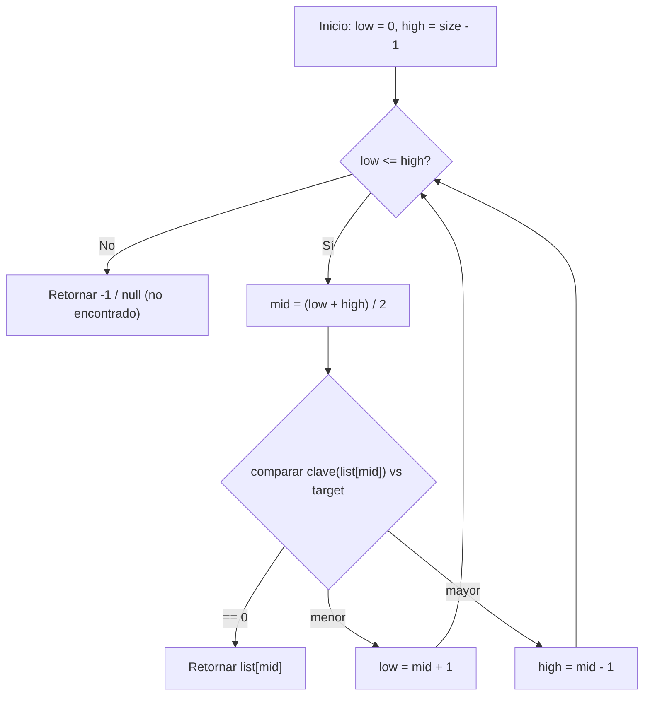
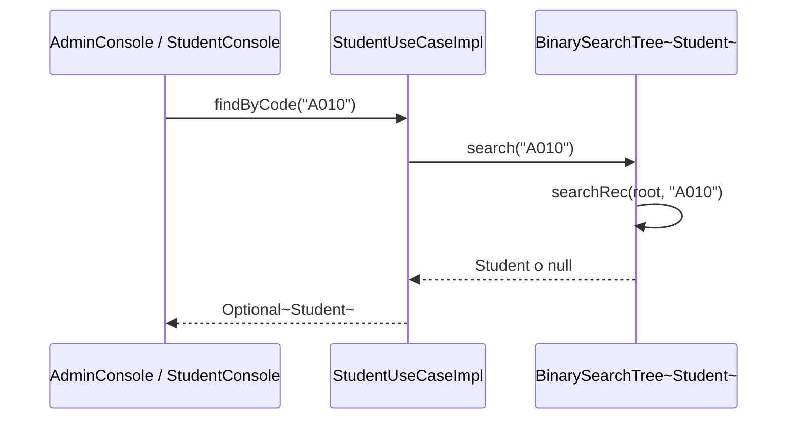
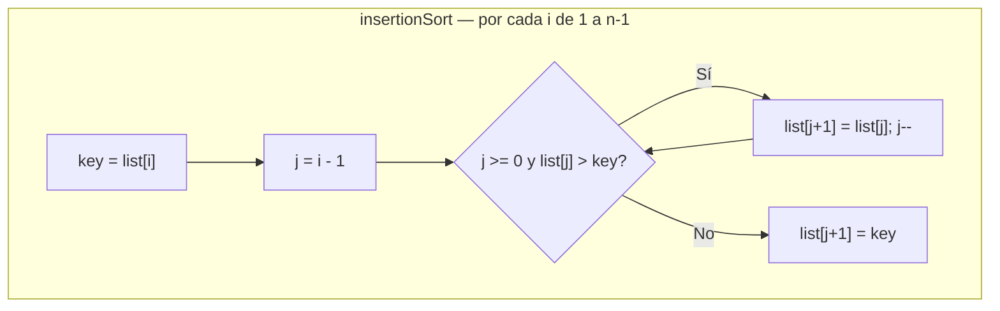
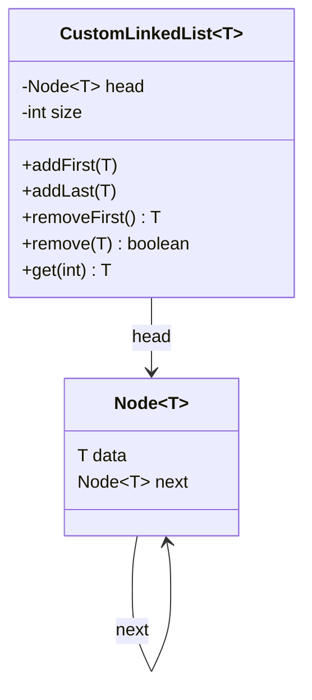
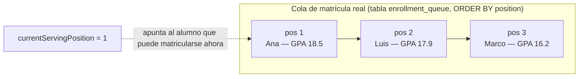
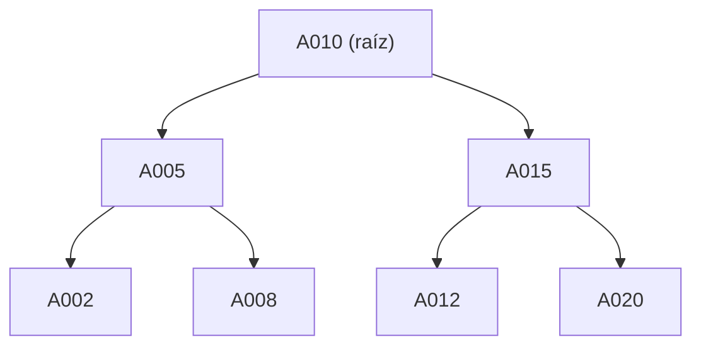
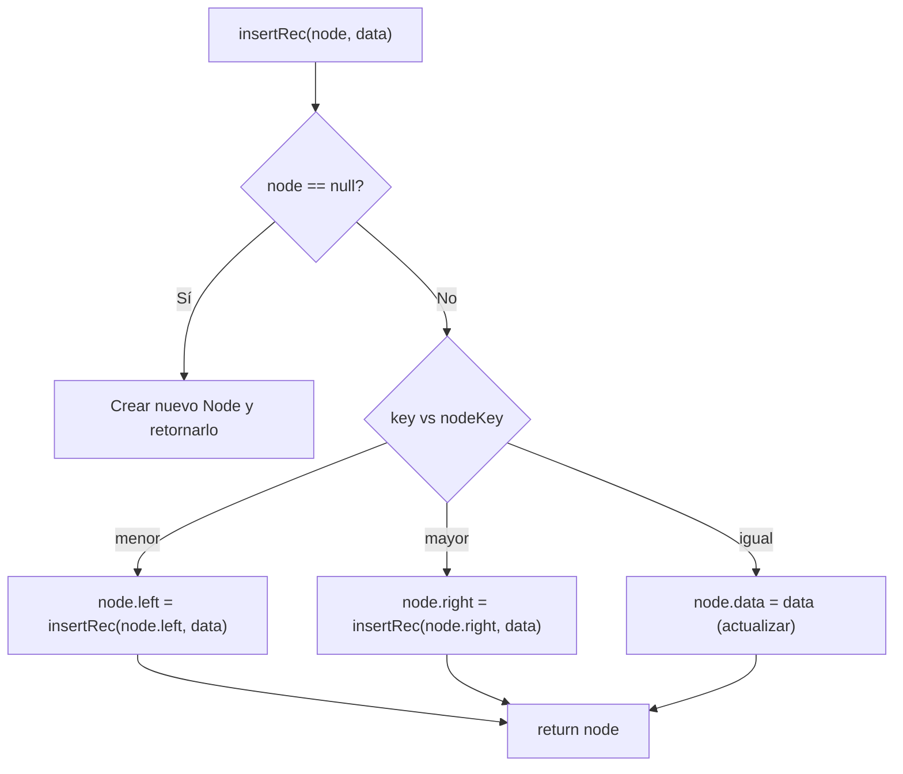
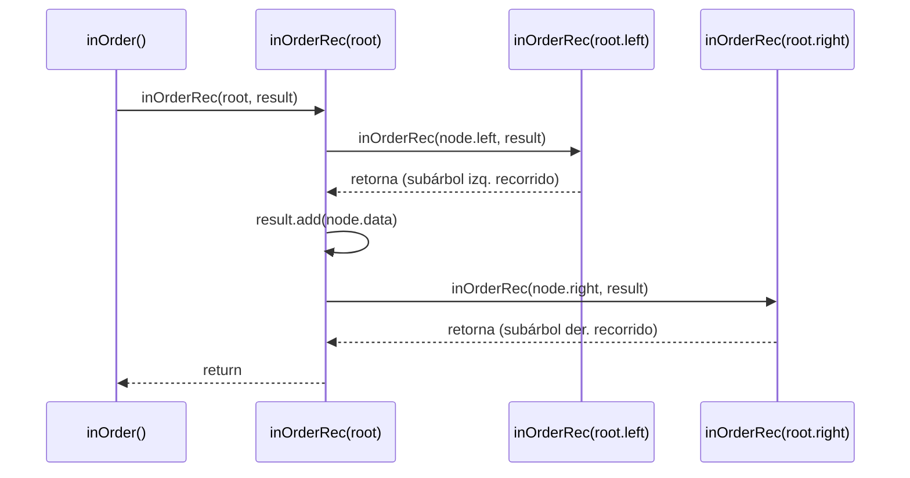
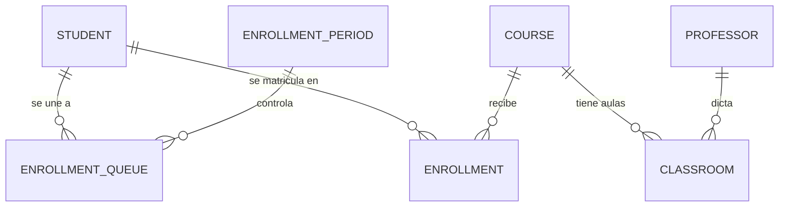

# Trazabilidad de requisitos académicos → implementación en el proyecto "Matricula"

Este documento explica, con evidencia concreta de código (archivo y línea), dónde y cómo se cumple cada punto solicitado. El "negocio real" modelado es el **proceso de matrícula/inscripción universitaria**: alumnos que se ponen en cola, un administrador que abre la matrícula por orden de prioridad (promedio ponderado), asignación de cupos por curso y gestión de aulas/profesores.

---

## 1. Modelado de procesos de negocio real como algoritmos

El proceso real modelado es **la matrícula universitaria con cola de prioridad**, equivalente a un sistema de turnos de atención al cliente. Está implementado principalmente en la capa de casos de uso:

- **[EnrollmentUseCaseImpl.java:36-49](src/application/usecase/EnrollmentUseCaseImpl.java#L36-L49) — `joinQueue`**: un alumno "toma turno" en la cola de matrícula. Verifica que no esté ya en cola (`existsByStudent`) y calcula su posición como `getMaxPosition() + 1`, igual que un dispensador de tickets.
- **[EnrollmentUseCaseImpl.java:71-95](src/application/usecase/EnrollmentUseCaseImpl.java#L71-L95) — `openEnrollment`**: al abrir la matrícula, se **reordena toda la cola** por promedio ponderado descendente (mejor promedio matricula primero) y se activa el periodo (`currentServingPosition = 1`). Es la regla de negocio central del sistema.
- **[EnrollmentUseCaseImpl.java:106-135](src/application/usecase/EnrollmentUseCaseImpl.java#L106-L135) — `enrollStudent`**: encadena las validaciones reales de una matrícula: periodo abierto → es el turno del alumno → no excede el máximo de cursos (`MAX_COURSES_PER_STUDENT = 5`, línea 16) → no está duplicado en el curso → el curso tiene vacantes disponibles.
- **[EnrollmentUseCaseImpl.java:149-169](src/application/usecase/EnrollmentUseCaseImpl.java#L149-L169) — `isStudentTurn`, `advanceQueue`**: simula el "siguiente número, por favor" de un turnero físico.
- **[StudentConsole.java:123-198](src/infrastructure/ui/console/StudentConsole.java#L123-L198) — `matricularse`**: flujo de negocio completo desde la UI — valida turno, filtra cursos ya cursados, permite elegir varios cursos y al terminar cede el turno (`advanceQueue()`, línea 196).
- **[AdminUseCaseImpl.java:37-77](src/application/usecase/AdminUseCaseImpl.java#L37-L77)**: apertura/cierre de matrícula por curso o de forma global (control administrativo del proceso).
- **[CourseUseCaseImpl.java:61-72](src/application/usecase/CourseUseCaseImpl.java#L61-L72) — `addClassroom`**: regla de negocio de asignación de aulas y profesores a un curso (equivalente a "asignación de inventario/recursos").
- **[db/schema.sql](db/schema.sql)** (tablas `enrollment_queue` y `enrollment_period` con `current_serving_position`): respaldo persistente del proceso de negocio modelado.

---

## 2. Estructuras de datos (listas, pilas, colas, árboles o grafos)

| Estructura | Dónde | Para qué se usa |
|---|---|---|
| **Lista enlazada simple (propia)** | [CustomLinkedList.java:9-130](src/shared/datastructure/CustomLinkedList.java#L9-L130), con clase interna `Node<T>` (líneas 11-18) e iterador propio (líneas 111-129) | Implementación desde cero de una lista enlazada (no usa `java.util.LinkedList`), con `addFirst`, `addLast`, `removeFirst`, `remove`. |
| **Árbol Binario de Búsqueda (propio)** | [BinarySearchTree.java:11-130](src/shared/datastructure/BinarySearchTree.java#L11-L130) | Usado en [StudentUseCaseImpl.java:13-19](src/application/usecase/StudentUseCaseImpl.java#L13-L19) como `studentTree`, indexando alumnos por código para búsqueda eficiente (`findByCode`, líneas 32-40) y listado ordenado vía recorrido inorden (`findAll`, líneas 47-54). |
| **`List<T>` / `ArrayList<T>`** | Uso extendido en toda la capa `application` e `infrastructure` (ej. [EnrollmentUseCaseImpl.java:75](src/application/usecase/EnrollmentUseCaseImpl.java#L75), todos los `*RepositoryImpl.java`) | Transportar colecciones de entidades (alumnos, cursos, matrículas, cola) entre capas. |
| **Cola de negocio como lista ordenada por posición** | Tabla `enrollment_queue` en [db/schema.sql](db/schema.sql), consultada con `ORDER BY eq.position` en [EnrollmentQueueRepositoryImpl.java](src/infrastructure/persistence/postgresql/EnrollmentQueueRepositoryImpl.java), entidad [EnrollmentQueueEntry.java](src/domain/model/EnrollmentQueueEntry.java) | Es la implementación real de la "cola de matrícula": no usa `java.util.Queue`, sino una lista con campo `position`, reordenada manualmente tras el sort (`getMaxPosition()+1` para encolar, `updatePositions` para reordenar). |
| **`Map` (`LinkedHashMap`)** | [AdminUseCaseImpl.java:80-103](src/application/usecase/AdminUseCaseImpl.java#L80-L103) — `getEnrollmentSummary` | Estructura de agregación para el resumen administrativo de matrícula por curso, mostrado en [AdminConsole.java:418-449](src/infrastructure/ui/console/AdminConsole.java#L418-L449). |
| **`Optional<T>`** | Todos los puertos de salida en `domain/port/output/*.java` | Manejo seguro de ausencia de resultado en búsquedas por clave (patrón null-safety). |

> Nota honesta: el proyecto **no usa** `Stack`, `Deque`, `TreeMap/TreeSet` ni grafos — el árbol y la lista enlazada están hechos a mano en `shared/datastructure`, lo cual demuestra mejor el dominio de la estructura interna (nodos, punteros, recursión) que usar la clase de Java directamente.

---

## 3. Algoritmos de ordenamiento, búsqueda, recorrido y toma de decisiones

**Ordenamiento** — implementados desde cero en [SortingAlgorithms.java](src/shared/algorithm/SortingAlgorithms.java):
- `insertionSort` (líneas 14-25), `bubbleSort` (líneas 27-38), `quickSort` con partición Lomuto (líneas 40-63, recursivo).
- **Uso real de negocio**: [EnrollmentUseCaseImpl.java:79](src/application/usecase/EnrollmentUseCaseImpl.java#L79) — `SortingAlgorithms.insertionSort(queue, EnrollmentQueueEntry::compareTo)` ordena la cola de matrícula por prioridad.
- [EnrollmentQueueEntry.java:27-36](src/domain/model/EnrollmentQueueEntry.java#L27-L36) implementa `Comparable`: compara por promedio ponderado (desc), luego apellido, luego nombre — es el criterio de orden de negocio.
- [Student.java:21-24](src/domain/model/Student.java#L21-L24) implementa `Comparable<Student>` por código.

**Búsqueda** — en [SearchAlgorithms.java](src/shared/algorithm/SearchAlgorithms.java):
- `sequentialSearch` (líneas 14-20), `binarySearch` (líneas 25-39), `binarySearchByKey` (líneas 44-59).
- La búsqueda real de un alumno por código se resuelve vía el BST (`BinarySearchTree.search`) en [StudentUseCaseImpl.java:35](src/application/usecase/StudentUseCaseImpl.java#L35).
- Búsquedas por código vía SQL (`WHERE code = ?`) en todos los `*RepositoryImpl.java`, ej. [StudentRepositoryImpl.java:36-47](src/infrastructure/persistence/postgresql/StudentRepositoryImpl.java#L36-L47).

**Recorridos**:
- Recorrido inorden recursivo del BST: [BinarySearchTree.java:99-111](src/shared/datastructure/BinarySearchTree.java#L99-L111).
- Recorridos `for`/`forEach` sobre listas, ej. [AdminConsole.java:261-267](src/infrastructure/ui/console/AdminConsole.java#L261-L267) (matriculados/vacantes/aulas por curso), [StudentConsole.java:163-168](src/infrastructure/ui/console/StudentConsole.java#L163-L168) (cursos disponibles).
- `while(rs.next())` para recorrer `ResultSet` JDBC en todos los repositorios, ej. [StudentRepositoryImpl.java:67-71](src/infrastructure/persistence/postgresql/StudentRepositoryImpl.java#L67-L71).

**Toma de decisiones**:
- Cadena de 5 validaciones `if` en [EnrollmentUseCaseImpl.java:107-135](src/application/usecase/EnrollmentUseCaseImpl.java#L107-L135) (matrícula abierta, turno, límite de cursos, duplicado, cupos).
- `switch` expressions (Java moderno) para navegación de menús en [AdminConsole.java](src/infrastructure/ui/console/AdminConsole.java) (líneas 45-53, 70-77, 140-147, 210-218, 318-333) y [MainConsole.java:28-36](src/infrastructure/ui/console/MainConsole.java#L28-L36).
- Validación de rango en [ConsoleHelper.java:29-44](src/infrastructure/ui/console/ConsoleHelper.java#L29-L44) (`readDouble`, promedio entre 0 y 20).

---

## 4. Evaluación de eficiencia y claridad del código; pruebas de ejecución

- El proyecto **no tiene un framework de pruebas automatizadas** (no hay JUnit, `pom.xml` ni carpeta `test/`); es un proyecto IntelliJ simple compilado directamente.
- La "evaluación de eficiencia y claridad" se sostiene en:
  - **Comentarios de intención/complejidad** en el propio código, ej. [EnrollmentUseCaseImpl.java:73-74](src/application/usecase/EnrollmentUseCaseImpl.java#L73-L74) ("Ordenar la cola usando Insertion Sort..."), [StudentUseCaseImpl.java:34,49](src/application/usecase/StudentUseCaseImpl.java#L34) ("Búsqueda eficiente usando el BST en memoria", "Recorrido inorden del BST, ordenado por código"), [BinarySearchTree.java:8-9](src/shared/datastructure/BinarySearchTree.java#L8-L9).
  - **Manejo exhaustivo de errores** como forma de validar la ejecución: cada adaptador JDBC captura `SQLException` y relanza `RuntimeException` con mensaje descriptivo (patrón repetido en los 7 `*RepositoryImpl.java`).
  - [Main.java:11-22](src/Main.java#L11-L22) valida la conexión a la base de datos al arrancar (`try/catch(SQLException)`, `System.exit(1)` si falla) e imprime mensajes de estado en consola.
  - [Main.java:45-50](src/Main.java#L45-L50) — `Runtime.getRuntime().addShutdownHook` para cierre limpio de la conexión.
  - [ConsoleHelper.java:17-44](src/infrastructure/ui/console/ConsoleHelper.java#L17-L44) — validación defensiva de entrada de usuario con reintento en bucle.
  - [db/seed.sql](db/seed.sql) actúa como **dataset de prueba manual** (10 profesores, 10 cursos, 15 alumnos con distintos promedios) para ejercitar en ejecuciones reales el algoritmo de ordenamiento de la cola y las reglas de cupos.
- **Oportunidad de mejora a documentar**: agregar pruebas unitarias (JUnit) sobre `SortingAlgorithms`, `SearchAlgorithms` y `BinarySearchTree` para formalizar la evaluación de casos (caso base, caso promedio, caso peor) y anotar complejidad Big-O explícitamente.

---

## 5. Programación modular, recursividad y tratamiento de datos en archivos

**Modularidad (arquitectura hexagonal / puertos y adaptadores)**:
- `src/domain/model/` — entidades puras sin dependencias externas (`Student`, `Professor`, `Course`, `Classroom`, `Enrollment`, `EnrollmentPeriod`, `EnrollmentQueueEntry`).
- `src/domain/port/input/` — interfaces de casos de uso (`EnrollmentUseCase`, `StudentUseCase`, `CourseUseCase`, `ProfessorUseCase`, `AdminUseCase`).
- `src/domain/port/output/` — interfaces de repositorio que desacoplan el dominio de la infraestructura.
- `src/application/usecase/` — implementaciones de la lógica de negocio, dependiendo solo de los puertos de salida (inyección de dependencias por constructor, ej. [EnrollmentUseCaseImpl.java:24-34](src/application/usecase/EnrollmentUseCaseImpl.java#L24-L34)).
- `src/infrastructure/persistence/postgresql/` — adaptadores JDBC concretos + [DatabaseConnection.java](src/infrastructure/persistence/postgresql/DatabaseConnection.java) (Singleton, líneas 10-39).
- `src/infrastructure/ui/console/` — adaptador de entrada (consola), desacoplado de la persistencia.
- `src/shared/` — utilidades transversales reutilizables (`algorithm/`, `datastructure/`) sin dependencias del dominio.
- [Main.java:24-43](src/Main.java#L24-L43) — **composition root**: única clase que instancia y conecta repos → casos de uso → consola (inyección de dependencias manual).

**Recursividad**:
- [BinarySearchTree.java](src/shared/datastructure/BinarySearchTree.java): `insertRec` (líneas 34-47), `searchRec` (53-63), `deleteRec` (71-91, con sucesor inorden vía `findMin`), `inOrderRec` (105-111), `sizeRec` (121-125) — todos se llaman a sí mismos recorriendo `node.left`/`node.right`.
- [SortingAlgorithms.java:40-46](src/shared/algorithm/SortingAlgorithms.java#L40-L46) — `quickSort` se llama a sí mismo dos veces tras particionar (divide y vencerás).

**Tratamiento de datos en archivos / persistencia**:
- **JDBC + PostgreSQL**: [DatabaseConnection.java:12-27](src/infrastructure/persistence/postgresql/DatabaseConnection.java#L12-L27) (Singleton con `DriverManager.getConnection`).
- Todos los `*RepositoryImpl.java` usan `PreparedStatement`/`ResultSet`, incluyendo *text blocks* de Java para consultas con JOIN.
- Batch update: [EnrollmentQueueRepositoryImpl.java:82-95](src/infrastructure/persistence/postgresql/EnrollmentQueueRepositoryImpl.java#L82-L95) — `updatePositions` usa `addBatch()`/`executeBatch()` para persistir el reordenamiento masivo de la cola.
- **Archivos SQL** (`db/`, aún sin commitear):
  - [db/schema.sql](db/schema.sql) — DDL completo (7 tablas, `FOREIGN KEY ... ON DELETE CASCADE`, y tabla `sequence_counters` para generar códigos correlativos, consumida por `generateNextCode()` en `StudentRepositoryImpl`, `ProfessorRepositoryImpl`, `ClassroomRepositoryImpl`).
  - [db/seed.sql](db/seed.sql) — datos de prueba con `INSERT ... ON CONFLICT DO NOTHING`.
  - [docker-compose.yaml](docker-compose.yaml) — contenedor `postgres:16` con volumen persistente, que provee la base de datos externa consumida por la app.

---

## 6. Verificación del alcance mínimo original del curso

El proyecto originalmente se planteó cubrir **al menos 3 de 6 puntos** del temario. Tras revisar el código, el resultado real es: **4 de 6 implementados y en uso activo, 1 implementado pero no conectado al flujo real, y 1 no implementado**. A continuación el detalle honesto de cada punto, con diagramas.

| # | Punto del temario | Estado | Dónde |
|---|---|---|---|
| 1 | Búsqueda (secuencial, binaria, transf. de claves) | ✅ Implementado (parcialmente en uso real) | `SearchAlgorithms.java`, `BinarySearchTree.search` |
| 2 | Ordenamiento (burbuja, inserción, quicksort) | ✅ Implementado (`insertionSort` en uso real) | `SortingAlgorithms.java` |
| 3 | Pilas, colas o listas enlazadas | ⚠️ Parcial (colas sí; listas enlazadas aisladas; pilas no existen) | `CustomLinkedList.java`, tabla `enrollment_queue` |
| 4 | Árboles binarios o generales | ✅ Implementado y en uso real | `BinarySearchTree.java`, `StudentUseCaseImpl` |
| 5 | Recursividad o backtracking | ✅ Recursividad sí; backtracking no | `BinarySearchTree.java`, `SortingAlgorithms.quickSort` |
| 6 | Algoritmos de grafos (opcional) | ❌ No implementado | — (relaciones existen solo como FK relacionales) |

### 6.1 Algoritmos de búsqueda — ✅ implementado, con matiz

`SearchAlgorithms.java` define `sequentialSearch` (líneas 14-20), `binarySearch` (25-39) y `binarySearchByKey` (44-59, búsqueda binaria "por transformación de clave": el `Function<T,String> keyExtractor` convierte cada elemento en su clave de comparación antes de aplicar el algoritmo). Se verificó con búsqueda en todo el repositorio (`grep`) que **estos tres métodos no tienen ningún llamador fuera de su propia clase** — están escritos y listos, pero no forman parte del flujo real de ejecución todavía.

La búsqueda que **sí se ejecuta en producción** es equivalente conceptualmente (recorrido guiado por comparación de claves) pero vía el BST: [StudentUseCaseImpl.java:35](src/application/usecase/StudentUseCaseImpl.java#L35) → `studentTree.search(code)`.

*Lógica de `binarySearch` / `binarySearchByKey` en [SearchAlgorithms.java:25-59](src/shared/algorithm/SearchAlgorithms.java#L25-L59) — la variante "por clave" reemplaza `comparator.compare` por `keyExtractor.apply(item).compareTo(key)`, es decir, transforma cada elemento a su clave string antes de comparar.*

*Camino de búsqueda que realmente se ejecuta en la app: consola → caso de uso → BST recursivo.*

### 6.2 Algoritmos de ordenamiento — ✅ implementado, con matiz

`SortingAlgorithms.java` define `insertionSort` (14-25), `bubbleSort` (27-38) y `quickSort` con partición Lomuto (40-63). De los tres, **solo `insertionSort` tiene un llamador real**: [EnrollmentUseCaseImpl.java:79](src/application/usecase/EnrollmentUseCaseImpl.java#L79). `bubbleSort` y `quickSort` están completos y correctos pero, igual que la búsqueda binaria, no están conectados a ningún flujo de negocio (código "de librería" preparado, no código muerto por error, pero tampoco ejercitado).

```mermaid
flowchart LR
    A["Admin: 'Aperturar matrícula del curso'"] --> B["EnrollmentUseCaseImpl.openEnrollment(courseId)"]
    B --> C["queue = queueRepository.findAll()"]
    C --> D["SortingAlgorithms.insertionSort(queue, EnrollmentQueueEntry::compareTo)"]
    D --> E["Reasignar position = 1..N según el nuevo orden"]
    E --> F["queueRepository.updatePositions(queue) — UPDATE en batch"]
    F --> G["period.setActive(true); currentServingPosition = 1"]
```

*`EnrollmentQueueEntry.compareTo` ([EnrollmentQueueEntry.java:27-36](src/domain/model/EnrollmentQueueEntry.java#L27-L36)) es el criterio de orden: promedio ponderado descendente, luego apellido, luego nombre.*

### 6.3 Pilas, colas o listas enlazadas — ⚠️ implementado de forma parcial

- **Pilas**: no existen en el proyecto. Se buscó `Stack`, `Deque`, `push(`, `pop(` en todo `src/` y no hay ningún resultado. Ninguna operación del sistema (matrícula, cola, aulas) requiere semántica LIFO, por lo que no había necesidad de negocio real que la motivara.
- **Listas enlazadas**: `CustomLinkedList<T>` ([CustomLinkedList.java:9-130](src/shared/datastructure/CustomLinkedList.java#L9-L130)) está completa (`addFirst`, `addLast`, `removeFirst`, `remove`, iterador propio), pero al igual que `bubbleSort`/`quickSort`/`SearchAlgorithms`, **no es referenciada por ninguna otra clase del proyecto** — es una estructura de apoyo preparada, aislada del resto del sistema.
- **Colas**: la única que sí opera en producción es la **cola de matrícula**, pero no se implementó con `java.util.Queue` ni con `CustomLinkedList`, sino como una **lista ordenada por el atributo `position`**, persistida en la tabla `enrollment_queue` ([db/schema.sql](db/schema.sql)) y consultada con `ORDER BY eq.position` en [EnrollmentQueueRepositoryImpl.java](src/infrastructure/persistence/postgresql/EnrollmentQueueRepositoryImpl.java). Funcionalmente se comporta como una **cola de prioridad**: se encola al final (`getMaxPosition()+1`) pero el orden de atención se recalcula por prioridad (GPA) al abrir la matrícula.

### 6.4 Árboles binarios o generales — ✅ implementado y en uso real

`BinarySearchTree<T>` genérico ([BinarySearchTree.java:11-130](src/shared/datastructure/BinarySearchTree.java#L11-L130)) es la estructura más "completa" del proyecto: `insert`, `search`, `delete` (con caso de sucesor inorden), `inOrder`, `size`. Se instancia como `studentTree` en [StudentUseCaseImpl.java:13-19](src/application/usecase/StudentUseCaseImpl.java#L13-L19), indexando alumnos por código, y se usa realmente para `findByCode` (búsqueda) y `findAll` (recorrido inorden → lista ordenada).

*Ejemplo de forma que tomaría el árbol al insertar alumnos por código — el recorrido inorden (izq → nodo → der) de este árbol produce A002, A005, A008, A010, A012, A015, A020, es decir, la lista ordenada que devuelve `findAll()`.*

### 6.5 Recursividad o backtracking — ✅ recursividad sí; ❌ backtracking no

Hay recursividad genuina (una función que se llama a sí misma reduciendo el problema) en dos lugares:

- **BST**: `insertRec`, `searchRec`, `deleteRec`, `inOrderRec`, `sizeRec` — todas recorren `node.left`/`node.right` llamándose a sí mismas ([BinarySearchTree.java](src/shared/datastructure/BinarySearchTree.java), líneas 34-125).
- **`quickSort`** ([SortingAlgorithms.java:40-46](src/shared/algorithm/SortingAlgorithms.java#L40-L46)): divide y vencerás clásico, aunque —como se explicó en 6.2— actualmente no tiene llamador real fuera de sí mismo.

No hay **backtracking** (ningún algoritmo que pruebe una decisión, retroceda y pruebe otra — típico de N-reinas, sudoku, generación de permutaciones o búsqueda de caminos con marcha atrás). Las validaciones de negocio de `enrollStudent` son secuenciales y no reintentan combinaciones.

*Cada nivel del árbol genera una nueva llamada recursiva; la pila de llamadas crece con la altura del árbol (no con backtracking, ya que ninguna llamada "deshace" una decisión anterior).*

### 6.6 Algoritmos de grafos — ❌ no implementado (opcional, y efectivamente no se hizo)

No hay listas/matrices de adyacencia, ni BFS, DFS, Dijkstra, ni detección de ciclos en el código. Las relaciones entre entidades (`Course` ↔ `Classroom` ↔ `Professor` ↔ `Enrollment` ↔ `Student`) existen únicamente como **claves foráneas relacionales** en [db/schema.sql](db/schema.sql), resueltas por PostgreSQL vía `JOIN`, no como una estructura de grafo recorrida por un algoritmo propio.

*Estas relaciones forman, conceptualmente, un grafo (nodos = entidades, aristas = FK), pero el proyecto no lo trata como tal: no hay una clase `Graph`/`AdjacencyList` ni un algoritmo de recorrido de grafo. Sería la extensión natural si en el futuro se modelan **prerrequisitos entre cursos** (que sí formarían un grafo dirigido acíclico, resoluble con DFS/orden topológico) — hoy esa tabla ni siquiera existe en el esquema.*
